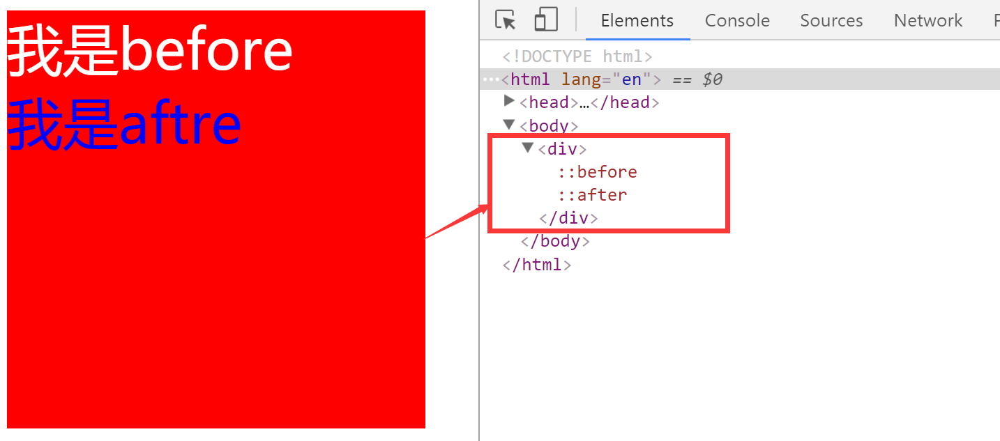

---
# 必填。项目名称。
title: "CSS常用选择器"
# 可选，和文章一样使用。
slug: CSS常用选择器
# 必填。发布/更新日期，如 2025-10-01。用于排序（配合 order）。
published: 2017-06-30
# 可选，默认 false。设为 true 时生产构建会隐藏该页，预览可见。
draft: false
# 可选。手动排序权重，越大越靠前；未设置则按 published 降序。
order: 1
# 可选。卡片简介 + 详情页描述。
description: "CSS常用选择器"
# 可选。封面图。支持完整 URL、公共根路径（/images/xxx.png）、相对路径（相对本文件目录，如 images/xxx.png）。留空则不显示封面。
image: "./images/1.png"
# 可选。项目状态，用标准 key:planning计划中 developing开发中 published已发布 archived已归档
status: "archived"
# 分类
category: CSS
tags:
  - CSS
# 可选。外链按钮数组：{ label, icon, value }。icon 可用 astro-icon 名（如 fa7-brands:github）、图片 URL，或留空用 label 首字母。
# link: []
# 可选。页面语言，如 zh_CN。
# lang: zh_CN
# 可选。标签，列表页与详情页显示为 #标签。
---
## CSS选择器
- 因为html和css分离，那么就出现一个问题，如何选择一个元素，将样式添加给这个元素-->css选择器
- 选择器是css属性和html元素的连接桥梁，通过正确的选择器来找到想要操作的元素，添加一定的样式。
- 选择器{}
<!-- more -->
### 1.语法
选择器{key:value;key:value;}

- 可以批量选择**选择器**名称相同的元素
- 通过选择器类型不同，可以选择不同的html元素


## 2.CSS基础选择器分类

### 1) 标签选择器
- 1-1).说明:直接使用元素标签进行选择
    - 例如：`<p></p>`
    - p{color:red;}
- 1-2).权重:1
```css
<style>
h1{color:red;}
</style>
<h1>标签选择器</h1>
```

### 2) 类选择器
- 2-1).说明:
    - 1).将html元素的class标签属性值当作选择器使用，需要在这个属性值前面加一个“.”
    - 2).通过元素的类名，来选择元素，一个元素可以有多个类名，都代表这个元素
    - 3).类名是元素class属性中的属性值，例如(下例中的sum即为类名)
        ```
        <p class='sum'></p>
        <style>.sum{}</style>
        ```
    - 4).一个html元素可以有多个css属性值（可以有多个类名，每一个类名之间用空格隔开）
    - 5).类名可以重复使用
- 2-2).权重:10
    - **类选择器最前方一定要有点**,例如:
```css
<style>
.title{color:red;}
</style>
<h1 class="title title1">标签选择器</h1>
<h1 class="title">标签选择器</h1>
//以上class属性名为title中的文字颜色都讲被设置为红色
```

### 3) id选择器
- 3-1).说明:
    - 1).一个html元素，id属性值只能用一次，id在html中具有唯一性
    - 2).类选择器最前方一定要有#
    - 3).通过元素的id名，来选择元素
    - 4).类名是元素id属性中的属性值(title/title1)，例如:
    ```css
    <style>
    #title{color:red;}
    </style>
    <h1 id="title title1">id选择器</h1>
    <h1 id="title">错误的，不识别</h1>
    ```
- 3-2).权重:100

## 总结(根据权重)：
> **标签选择器**相当于人的姓名,**类选择器**相当于人的名字,**id选择器**相当于身份证号码,是独一无二的。

### 4) 通配符选择器
- 4-1). 说明:
    - 1).通过*匹配全部html元素，包括根元素
    - 2).一般不使用，因为全部匹配耗性能
    - 3)语法:*{}
    ```css
    *{key:value}

    ```
- 4-2). 权重<1,可被覆盖


### 5) 并集选择器
- 5-1).说明:
    - 1). 你可以对选择器进行分组，这样，被分组的选择器就可以分享相同的声明。用逗号将需要分组的选择器分开。在下面的例子中，我们对所有的标题元素进行了分组。所有的标题元素都是绿色的。
    - 例如：
```css
h1,h2,h3,h4,h5,h6{color:green;}
```

### 6) 属性选择器
- 6-1).说明:
    - 1). 对带有指定属性的 HTML 元素设置样式，可以为拥有指定属性的 HTML 元素设置样式，而不仅限于 class 和 id 属性。
        - 下面的例子为带有 title 属性的所有元素设置样式：
        ```css
        [title]{
                color:red;
                }
        ```
    - 2). 利用标签的属性名和属性值来选择html元素
    - 3). **属性选择器在使用的时候，如果一个元素有两个类名，那么是不生效的。**
    - 4). 属性选择器我们一般不会使用class,因为class可以直接使用类选择器
      ```
      <!--有多少种方法只获取div?-->
       /*如果class值有两个，不能这样使用*/
      <style>[class=div1]{};</style>
      <div class="div1 p1" id="div2"></div>
      <p class="p1"></p>
      ```
- 6-2). 语法：
    - `[标签属性名]{}`
    - `[标签属性名=属性值]{}`
    ```css
    <style>
    h1[title]{} //交集选择器
    //权重:标签+属性的权重=11
    [type]{}
    //权重：10
    [type=text]{}
    //权重:10
    </style>
    <a href="" title="">link</a>
    ```
- 6-3). 权重:10


### 7)属性和值选择器
- 7-1). 说明:
    - 1). 下面的例子为 title="xx" 的所有元素设置样式：
    ```css
        [title=xx]
            {
            border:5px solid blue;
            }
    ```

    - 2). 设置表单的样式
    ```css
      input[type="text"]
      {
        width:150px;
        display:block;
        margin-bottom:10px;
        background-color:yellow;
        font-family: Verdana, Arial;
      }
     ```

### 8)分组选择器
- 8-1).作用(应用场景):
    - 1). 同一份css样式，可以一次性的添加给多个不同的html元素
- 8-2).语法：
    - 选择器1,选择器2,选择器3{};例如:
    ```css
    .box,li,.p1{color: red}
    .box{color:green}
    ```
- 8-3).权重
    - 1)分组选择器将不同的html分为一组，权重计算的时候都是独立计算，不会叠加。

### 9)交集选择器
- 9-1).一个元素具有**两个**属性(两种属性同属一个元素的时候)，可以使用交集选择器来进行元素的准确选择
- 9-2).组成选择器的两部分，必须属于同一个
    - 反例(错误用法):
    ```css
    <style>h1.p1{} //-->什么都选择不到</style>
    <p class="p1"></p>
    <h1></h1>
    ```
    - 正例(正确用法):
    ```css
    <p class='name1 name2' id='id1'></p>
    <style>
    //第一种:
    p.name1{}
    //第二种:
    p#id1{}
    //第三种:
    .name1.name2{}
    </style>
    ```
    - 使用解说(正确用法):
        - 1.组合选择器之间没有任何的符号和空格
        - 2.标签选择器和其他选择器组合的时候，标签选择器要放在前面
        - 3.交集选择器是两个选择器组合在一起，可以是1)标签和类名,2)标签和属性选择器,3)标签和id,4)两个类选择器。

- 9-3). 作用
    - 精确查找元素，增加选择器的权重
    ```css
    <style>
    h1{}
    //标签选择器 权重:1
    [title]{}
    //属性选择器 权重:10
    [title=xx]{}
    //属性选择器 权重:10
    h2[title]{}
    //交集选择器 权重:11
    h2[title=xx]{}
    //交集选择器 权重:11
    </style>
    <h1 title="xx"></h1>
    <h2 title="xx"></h2>

    <style>
    p.p1{}
    //交集选择器  权重:11
    </style>
    <p class="p1"></p>

    <style>
    .p1.p2{}
    //交集选择器  权重:20
    </style>
    <p class="p1 p2"></p>
    ```

### 10)子集选择器
- 10-1). 说明:
    - 1). 与后代选择器相比，子元素选择器只能选择作为某元素子元素的元素。
    - 2). 父级选择器是用来确定范围的，
    - 3). 子级选择器才是我们要添加样式的那个元素
    - 4). 子级选择器必须是紧邻的父子关系
- 10-2). 语法:
    - 父级选择器>子级选择器
- 10-3). 权重
    - 所有选择器之和

```css
<style>
ul>li{color:red;}
//选择ul下的li 权重:2
</style>
<ul>
    <li></li>
</ul>
```

### 11)后代选择器(派生选择器)
- 11-1). 说明:
    - 1). 在一个根元素的范围内，查找到它的后代元素
    - 2). 后代选择器在写的时候尽量控制在３个左右
    - 3). 选择器过多浪费性能，不建议使用
- 11-2). 举例:
    - 1). html结构：
    ```html
        <ol>
            <li><strong>我是斜体字。这是因为 strong 元素位于 li 元素内。</strong>
            </li>
        </ol>
    ```
    - 2). 列表中的 strong 元素变为斜体字，而不是通常的粗体字，可以这样定义一个派生选择器：
    ```css
        li strong {
            font-style: italic;
            font-weight: normal;
                    }
    ```
    - 3). 后代选择器在写的时候尽量控制在３个左右,选择器过多浪费性能:
    ```html
    <style>
    .div ul span{}
    </style>
    <div class="div">
        <ul>
            <li>
                <span>只选择这个span元素</span>
            </li>
        </ul>
    </div>
    ```

- 11-3). 语法:
    - 祖辈选择器 要查找的后代选择器{};(中间用空格连接)

### 12)相邻兄弟选择器
- 12-1). 说明:
    - 1). 相邻兄弟选择器可选择紧接在另一元素后的元素，且二者有相同父元素。
    - 2). 通过各个元素选择弟弟选择器,两个选择器之间用“+”连接;例如:
        - `h1 + p {margin-top:50px;}`
- 12-2).语法:
    - 哥哥选择器+弟弟选择器{};
    ```html
    <style>
        .list1+li{color:red;}
        //22222变为红色
        .list3+li{color:green;}
        //4444变为绿色
    </style>
    <ul>
        <li class="list1">11111</li>
        <li>22222</li>
        <li class="list3">33333</li>
        <li>4444</li>
    </ul>
    ```
- 12-3).权重:选择器之和

### 13)伪类选择器
- 13-1).说明:
    - 1). 给一个元素添加某种状态
        - 例如:鼠标经过时/获取焦点时/鼠标点击时
- 13-2). 权重:10
- 13-3).举例:
    - 1). a标签
        - CSS 伪类用于向某些选择器添加特殊的效果
        ```html
        <style>
            a:link {color: #FF0000}
            /* 未访问的链接 是默认状态*/
            a:visited {color: #00FF00}
            /* 已访问的链接 鼠标点击后的状态*/
            a:hover {color: #FF00FF}
            /* 鼠标移动到链接上 鼠标经过的状态*/
            a:active {color: #0000FF}
            /* 选定的链接 鼠标点击的状态*/
        </style>
        <a href="javascript:void (0)">最初形态</a>
        <a href="javascript:void 0">赛亚人形态</a>
        <a href="javascript:">超级赛亚人形态</a>
        ```
        - 2). input标签
        ```html
        <style>
                .input{border: 1px solid gainsboro}
                .input:hover{border-color: gray}
                .input:focus{border-color: blue}
                /*input:focus 鼠标聚焦后的状态，input独有的属性*/
        </style>
        <input type="text" class="input">
        ```

### 14)CSS 伪元素
- 14-1). 说明:
    - 1). 通过css代码向指定元素**内**添加假的（html中不存在的）元素
- 14-2). 举例:
    - CSS 伪元素用于向某些选择器设置特殊效果
        - 1)before
        - "before"会出现在div所有内容之前
        - ":before"伪元素可以在元素的内容前面插入新内容。
        - 下面的例子在每个 `<h1>` 元素前面插入内容:'我是一个伪元素'：
        ```css
        h1:before
          {
          content:'我是一个伪元素';
          }
        ```
        - 2)after
        - 会出现在div所有内容之后
使用伪元素的时候要保证两个前提
        - 2-1)要有display这个属性
        - 2-2)要有content这个属性，这个属性的属性值可以为空，但是引号不能少(`content:""`):
        ```html
        <style>
            div{
                width: 300px;
                height: 300px;
                background-color: red;
                }
            div:before{
                display: block;
                content: "我是before";
                font-size: 40px;
                color: white;
                       }
            div:after{
                display: block;
                content: "我是aftre";
                font-size: 40px;
                color: blue;
                      }
        </style>
        <div>
            <span>我是span</span>
        </div>
        ```
        - **网页显示**：
"伪元素选择器"

## 注意
### 1.选择器的查找机制
- 选择器的查找机制是从右向左,例如:
```html
<style>
.div ul li{}
<!-- 第一步选择这个文档中所有的li
第二步选择哪些li是ul下面的
第三步选择哪些li是ul下面，ul还是.div1下面的 -->
</style>

```
### 2.选择器的组成最好不要超过三个
### 3.后代选择器没有必要将每一层元素都写出来，只写那些关键节点即可(具有代表性的)
