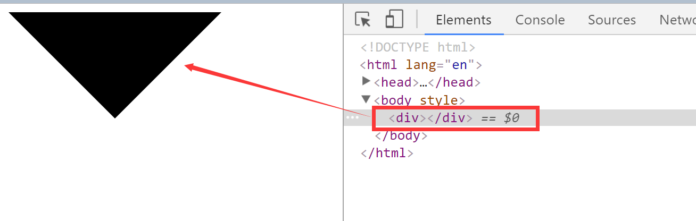
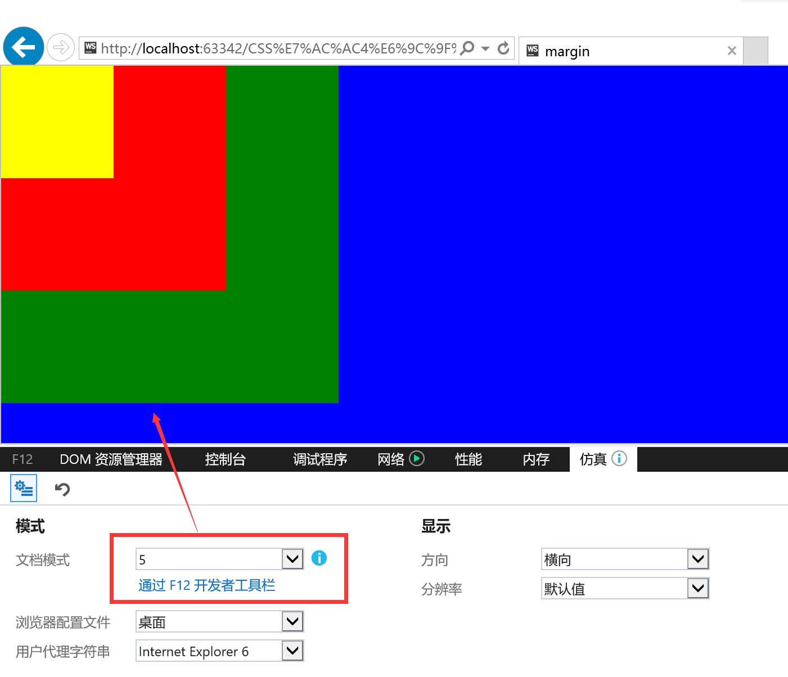
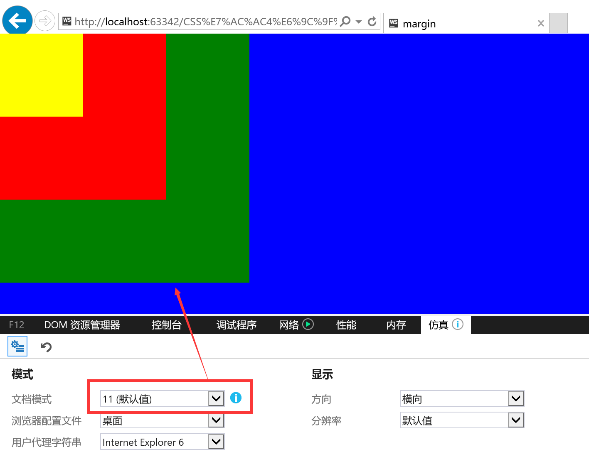
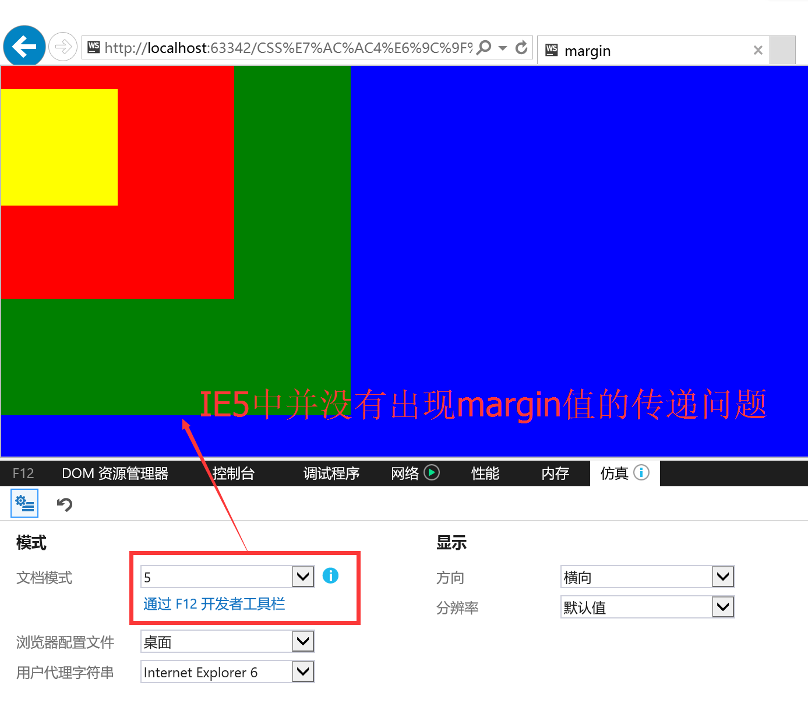
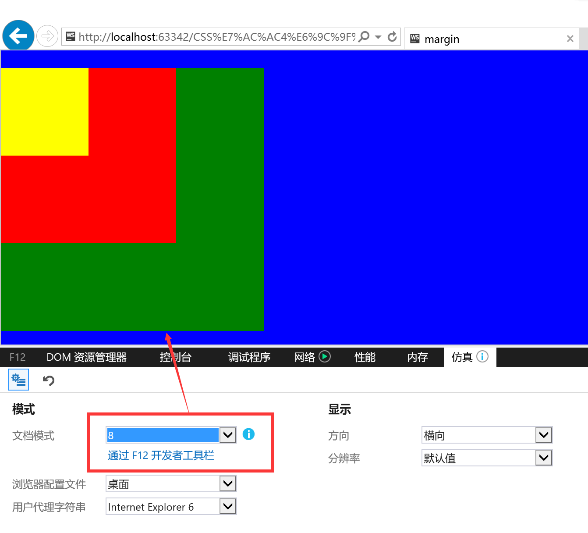
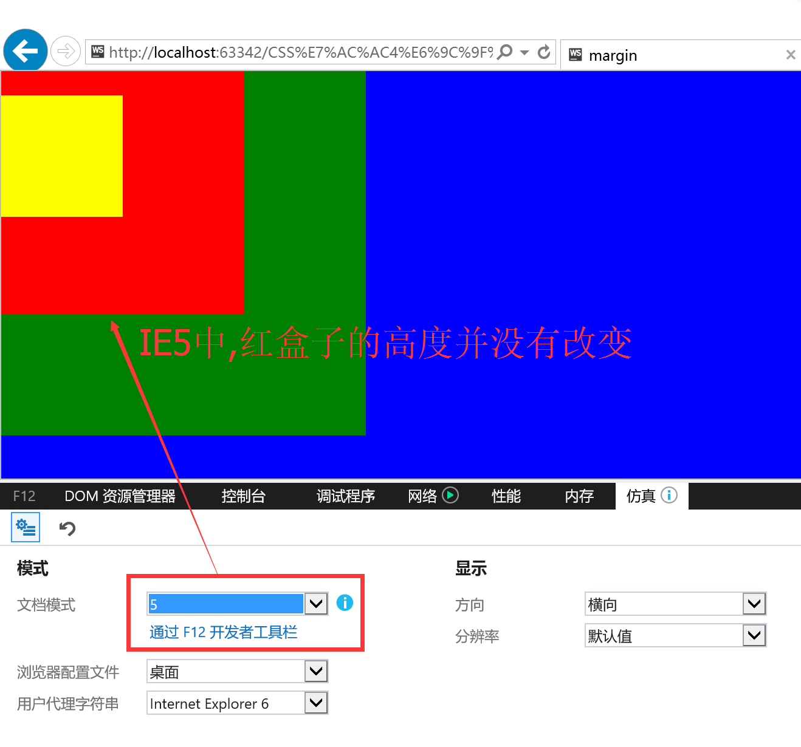
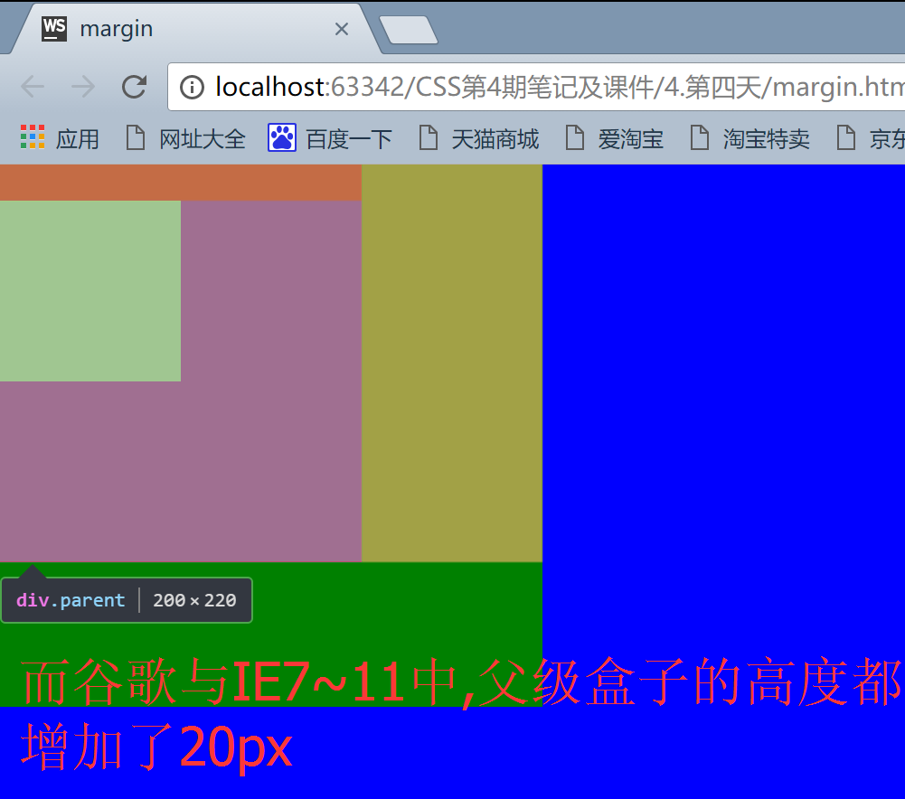
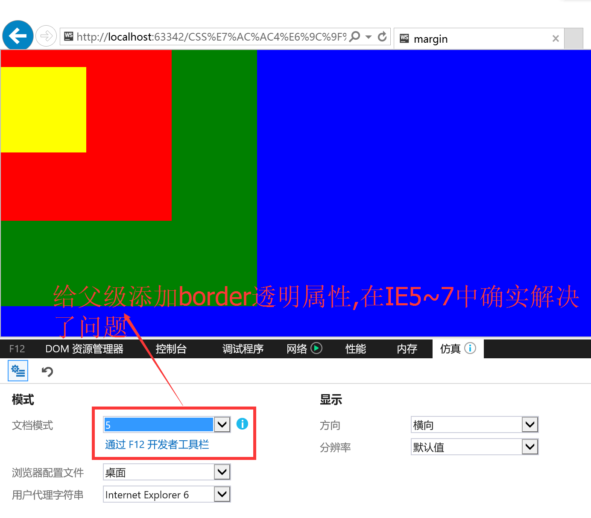
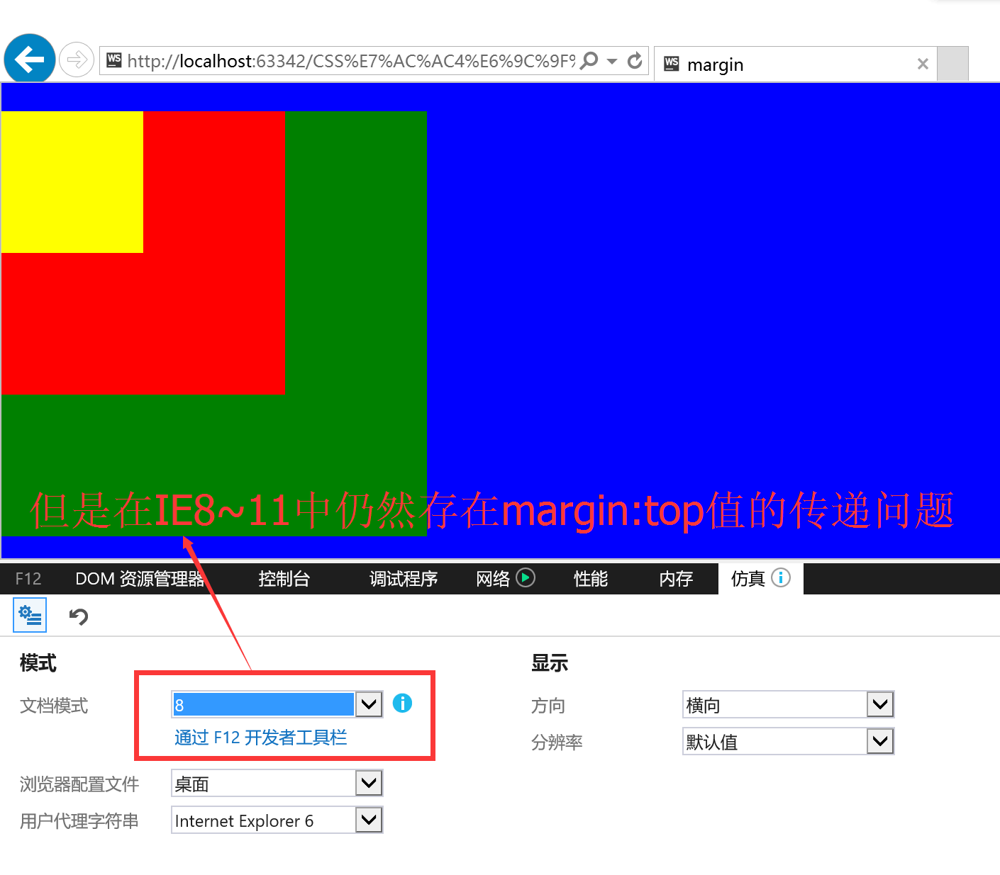

---
# 必填。项目名称。
title: "CSS盒子模型(border画三角形)及常见兼容问题解决方案"
# 可选，和文章一样使用。
slug: CSS盒子模型(border画三角形)及常见兼容问题解决方案
# 必填。发布/更新日期，如 2025-10-01。用于排序（配合 order）。
published: 2017-08-21
# 可选，默认 false。设为 true 时生产构建会隐藏该页，预览可见。
draft: false
# 可选。手动排序权重，越大越靠前；未设置则按 published 降序。
order: 1
# 可选。卡片简介 + 详情页描述。
description: "CSS盒子模型(border画三角形)及常见兼容问题解决方案"
# 可选。封面图。支持完整 URL、公共根路径（/images/xxx.png）、相对路径（相对本文件目录，如 images/xxx.png）。留空则不显示封面。
image: "./images/三角形.png"
# 可选。项目状态，用标准 key:planning计划中 developing开发中 published已发布 archived已归档
status: "archived"
# 分类
category: CSS
tags:
  - CSS
  - CSS盒模型
  - border画三角形
  - 兼容问题
# 可选。外链按钮数组：{ label, icon, value }。icon 可用 astro-icon 名（如 fa7-brands:github）、图片 URL，或留空用 label 首字母。
# link: []
# 可选。页面语言，如 zh_CN。
# lang: zh_CN
# 可选。标签，列表页与详情页显示为 #标签。
---
- 每一个元素在html中都是一个盒子,用来装其他盒子或者是内容

- 可以将html页面看做是一个仓库,仓库中从上到下摆了很多箱子,易碎品(盒子和盒子之间要有间距 内容和盒子之间要有填充 盒子本身要有厚度)
<!-- more -->
## 宽高属性
- 1.height: 100%;
    - 指的是继承父级元素*内容*的高度
- 2.width: 100%;
    - 指的是继承父级元素*内容*的宽度

## 特性
- 1.父子关系的时候,在设置margin值的时候,一般只设置上和左,不会设置下和右

- 2.盒子自身的宽度是由左侧边框的宽度+左侧内边距+内容的宽度+右侧内边距+右侧边框的宽度:
```css
ALLwidth=(border-left-width)+(padding-left)+width+(padding-right)+(border-right-width)
```

## padding和margin
```css
padding:1px 2px 3px 4px;//上 右 下 左
    //top right bottom left
padding:1px 2px 3px;//上 左右 下
    //top left/right bottom
padding:1px 2px;//上下 左右
    //top/bottom left/right
```


## border
```css
border-top-width: 1px; //上边框的宽度
border-top-style: solid; //上边框的样式
border-top-color: red; //上边框的颜色
border-color:red green yellow pink;//上 右 下 左
//上边框红色 右边框绿色 下边框黄色 左边框粉色
border-color:red green yellow;//上 左右 下
//上边框红色 左右边框绿色 下边框黄色
border-color:red green;//上下 左右
//上下边框红色 左右边框绿色

//合并缩写设置:
border-top:1px solid pink;//上边框1px 实线 粉色
border-bottom:1px solid pink;
border-right:1px solid pink;
border-left:1px solid pink;
border:1px solid pink;
```

### 利用border画三角形
```html
<style>
    div{
        border:100px solid/* red*/;
        /*border-color: yellow red blue pink;*/
        border-color: black transparent transparent;
        /*transparent透明的*/
        width: 0;
        }
</style>
```
"利用border画三角形"

## 常见问题解决方案
### 1.margin支持负值
- margin-left和margin-top为负值的时候 跑出浏览器的部分会被吃掉,不会撑开整个页面.

### 2.margin-top的传递问题
- 如果父级没有padding-top或border-top值得时候,子元素设置margin-top值,会将这个值传递给父元素
```html
<style>
    html,body,div{
        padding: 0;
        margin: 0;
        background: blue;
    }
    .box3{
        width: 300px;
        height: 300px;
        background-color: green;
    }
    .parent{
        width: 200px;
        height: 200px;
        background-color: red;
    }
    .son{
        width: 100px;
        height: 100px;
        background-color: yellow;
        /*margin-top: 20px;*/
    }
</style>
<div class="box3">
    <div class="parent">
        <div class="son"></div>
    </div>
</div>
```
- 此时:在IE5~11,以及谷歌浏览器中的显示都是一致的,如下图(图片以IE浏览器截图为主)




- 当给子元素.son设置margin-top:20px;值后

    - IE5~7中并没有出现margin值的传递问题(IE7同IE5,这里就没有截图了)
    

    - IE8~11以及谷歌中均出现margin-top值传递问题
    

#### 解决方法:
##### 方法一) 给父级元素一个属性,overflow:hidden;
    - 弊端:
    - overflow:hidden;有溢出隐藏的含义,若给父级元素添加这个属性,子级元素超出父级盒子部分将不能显示,例如子级元素的阴影

##### 方法二) 将子级元素的margin-top值去掉,改成父级元素的padding-top值(**建议使用这个方法**)
    - 但是此方法也有弊端:
    - IE5中父级盒子的高度并没有改变
    
    - IE7~11及谷歌浏览器中,父级盒子的高度都增加了20px;
    

##### 方法三) 给父级元素上添加一个透明的border处理

- 弊端:
    - 在IE5~7中确实解决了问题
    
    - 但是在IE8~11及谷歌浏览器中仍然存在margin-top的传递问题
    

### 3.margin-left/margin-right 在ie6中会双倍

- 当元素浮动的时候,有左右的外边距,有时候ie6会出现双倍边距的问题

#### 解决方案:解决双边距这个方法叫css hack
##### 方案一). 给这个元素添加`overflow:hidden;`
##### 方案二). 写ie6的兼容方式,例如:
```css
div{
float:left;
margin-left:10px !important;
_margin-left:5px;
<!-- 当浏览器是ie6的时候 读取_margin-left:5px;这句话 -->
}
```
- 注意:**!important**出现在css里面的时候,这个属性会覆盖掉所有之前设置的样式**权重最大,比id选择器还大**

## overflow盒子内容多余部分的处理方式
- overflow:hidden; 直接将多余隐藏
- overflow:auto; 如果有多余部分出现滚动条,如果没有就不出现
- overflow:scroll; 不论是否有多余部分,都会出现滚动条