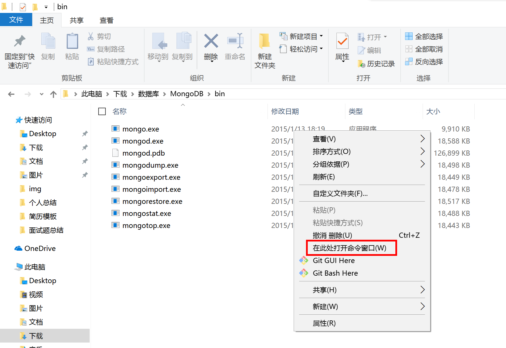
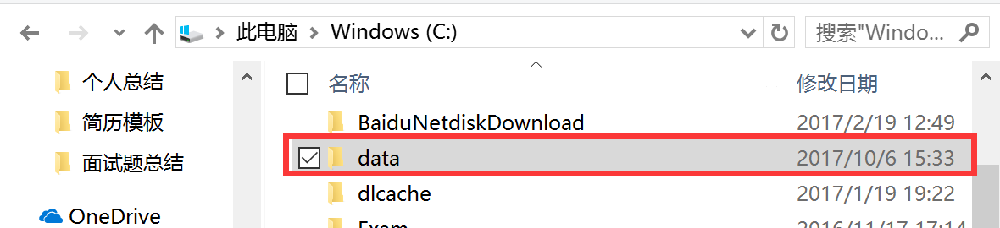
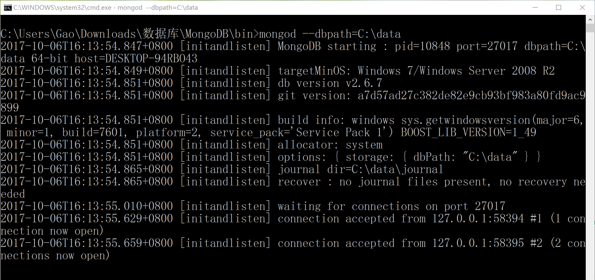
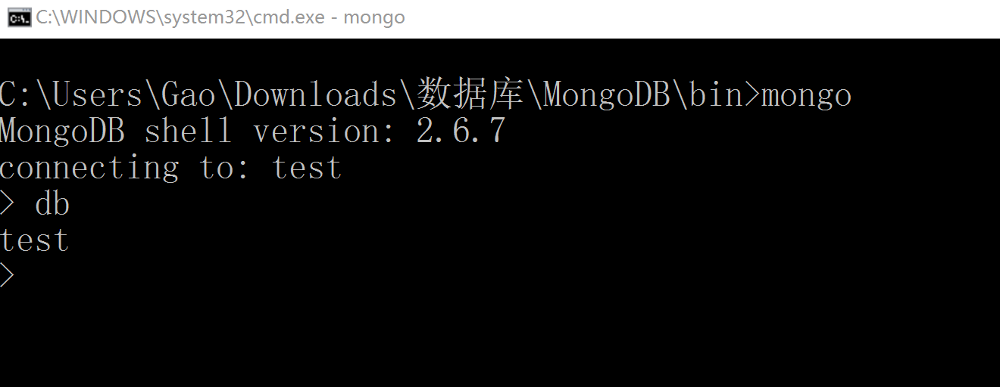
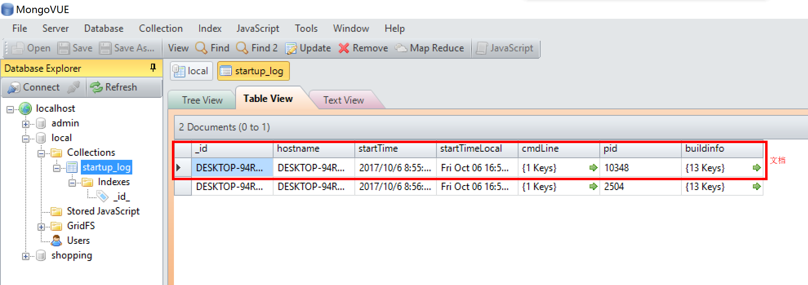

---
# 必填。项目名称。
title: "MongoDB启动与连接"
# 可选，和文章一样使用。
slug: MongoDB数据库的启动与连接
# 必填。发布/更新日期，如 2025-10-01。用于排序（配合 order）。
published: 2017-10-06
# 可选，默认 false。设为 true 时生产构建会隐藏该页，预览可见。
draft: false
# 可选。手动排序权重，越大越靠前；未设置则按 published 降序。
order: 1
# 可选。卡片简介 + 详情页描述。
description: "MongoDB数据库的启动与连接"
# 可选。封面图。支持完整 URL、公共根路径（/images/xxx.png）、相对路径（相对本文件目录，如 images/xxx.png）。留空则不显示封面。
image: "./images/MongoDB安装目录.png"
# 可选。项目状态，用标准 key:planning计划中 developing开发中 published已发布 archived已归档
status: "archived"
# 分类
category: 数据库
tags:
  - MongoDB
  - 数据库
# 可选。外链按钮数组：{ label, icon, value }。icon 可用 astro-icon 名（如 fa7-brands:github）、图片 URL，或留空用 label 首字母。
# link: []
# 可选。页面语言，如 zh_CN。
# lang: zh_CN
# 可选。标签，列表页与详情页显示为 #标签。
---

## 什么是`MongoDB`

- `MongoDB`是一个基于分布式文件存储的开源数据库系统
- `MongoDB` 将数据存储为一个文档，数据结构由键值(`key`=>`value`)对组成。`MongoDB` 文档类似于 `JSON` 对象。字段值可以包含其他文档，数组及文档数组。
<!-- more -->

## `MongoDB`安装

### `windows`安装

> `Windows`官方安装指南 绿色版就是解压之后就可以用

- mongodb32位绿色版 [http://pan.baidu.com/s/1pLe3vM7](http://pan.baidu.com/s/1pLe3vM7)
- MongoDB64位绿色版 [http://pan.baidu.com/s/1cMM9oq](http://pan.baidu.com/s/1cMM9oq)
- mongo客户端绿色版 [http://pan.baidu.com/s/1kUIQlUZ](http://pan.baidu.com/s/1kUIQlUZ)

### `Mac`官方安装指南

- 1.先安装`homebrew`
  - `Homebrew`简称`brew`，是`Mac OSX`上的软件包管理工具，能在`Mac`中方便的安装软件或者卸载软件[http://brew.sh/](http://brew.sh/)
  - `Homebrew`的安装非常简单，打开终端复制、粘贴以下命令，回车，搞定

    ```js
    /usr/bin/ruby -e "$(curl -fsSL https://raw.githubusercontent.com/Homebrew/install/master/install)"
    ```

- 2.使用`brew`安装`mongodb`

```js
brew install mongodb
```

- 3.创建数据存放目录

```js
sudo mkdir -p /data/db
```

> 如果提示输入密码请输入正确的密码

- 4.启动`mongodb`

```js
sudo mongod &
```

#### `Mac`可视化工具可安装`Robomongo`

## mongodb启动与连接

### 1.windows启动服务器端

- 1) 找到`mongodb`安装目录,一般是 `C:\Program Files\MongoDB 2.6 Standard\bin` (这里我下载到了`C:\Users\Gao\Downloads\数据库\MongoDB`这个目录)

- 2) 按下Shift+鼠标右键,选择在此处打开命令窗口
- 3) 在除C盘外的盘符新建一个空目录,例如 D:\Mongodb\data(由于我的电脑没有分盘,所以我就建在C盘下了)
  
  - 在命令行中输入mongod --dbpath=刚创建的空目录,如

  ```js
  mongod --dbpath=C:\data
  ```

  - 1. 注意：--dbpath后的值表示数据库文件的存储路径,而且后面的路径必须事先创建好，必须已经存在，否则服务开启失败

  > 如果是windows32的系统用户，请加参数 --storageEngine=mmapv1

  > 如 `mongod --dbpath=C:\data --storageEngine=mmapv1`

- 4) 再按回车键
  
  - 1. 如果出现`waiting for connections on port 27017`就表示启动成功,已经在`27017`端口上监听了客户端的请求
  - 2. 注意：这个命令窗体绝对不能关,关闭这个窗口就相当于停止了`mongodb`服务
  - 3. **如果`mongoVUE`客户端报错 `“MongoDB.Bson.BsonObjectId”`的类型初始值设定项引发异常**

    > 解决方案如下：在`window`中打开功能里输入`regedit`,回车打开注册器。然后进入如下路径中 `HKEY_LOCAL_MACHINE\system\CurrentControlSet\Control\Lsa\FipsAlgorithmPolicy` 将`enable`设置为`0`即可。

### 2.启动客户端连接服务器

- 1) 找到`mongodb`安装目录,一般是 `C:\Program Files\MongoDB 2.6 Standard\bin`
- 2) 按下`Shift+鼠标右键`,选择在此处打开命令窗口

- 3) 命令窗体中输入 `mongo --host=127.0.0.1` 或者 `mongo` 按回车键
- 4) 命令窗体中输入 `db` 按回车键可进入测试


> 备注：`--host`后的值表示服务器的`ip`地址,`--host=127.0.0.1` 表示的就是本地服务器,每次数据库都会默认连接`test`数据库

## `MongoDB`基本概念

- 数据库 `MongoDB`的单个实例可以容纳多个独立的数据库，比如一个学生管理系统就可以对应一个数据库实例
- 集合 数据库是由集合组成的,一个集合用来表示一个实体,如学生集合
- 文档 集合是由文档组成的，一个文档表示一条记录,比如一位同学张三就是一个文档
