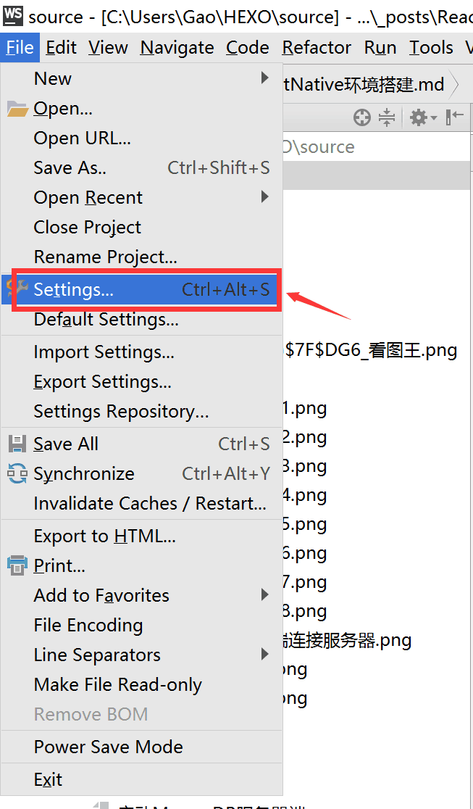
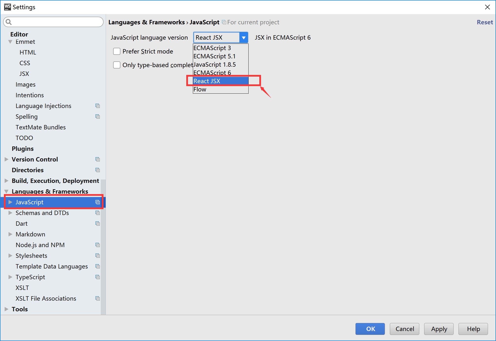

---
# 必填。项目名称。
title: "ReactNative环境搭建"
# 可选，和文章一样使用。
slug: ReactNative环境搭建
# 必填。发布/更新日期，如 2025-10-01。用于排序（配合 order）。
published: 2018-01-24
# 可选，默认 false。设为 true 时生产构建会隐藏该页，预览可见。
draft: false
# 可选。手动排序权重，越大越靠前；未设置则按 published 降序。
order: 1
# 可选。卡片简介 + 详情页描述。
description: "ReactNative环境搭建"
# 可选。封面图。支持完整 URL、公共根路径（/images/xxx.png）、相对路径（相对本文件目录，如 images/xxx.png）。留空则不显示封面。
image: "./images/webstore打开设置窗口.png"
# 可选。项目状态，用标准 key:planning计划中 developing开发中 published已发布 archived已归档
status: "archived"
# 分类
category: ReactNative
tags:
  - ReactNative
# 可选。外链按钮数组：{ label, icon, value }。icon 可用 astro-icon 名（如 fa7-brands:github）、图片 URL，或留空用 label 首字母。
# link: []
# 可选。页面语言，如 zh_CN。
# lang: zh_CN
# 可选。标签，列表页与详情页显示为 #标签。
---

> 官方中文文档地址[https://reactnative.cn/docs/0.51/getting-started.html](https://reactnative.cn/docs/0.51/getting-started.html)

- 如果是ios并不长，如果是安卓相对繁琐一些
- 操作系统分为:macOS/Linux/Windows
- 在macOS下可以开发ios和安卓的，但是Linux/Windows只能开发安卓的(如果工作中老板要你用ReactNative，你尽量和老板申请个mac本)

<!-- more -->
## 步骤

### 1.安装Node.js/Homebrew

- 百度搜索Node.js
- Mac环境(百度搜索Homebrew)

### 1-1.Node.js安装

- 安装后需要配置一下环境变量(我的电脑-属性-高级系统设置-环境变量(path中的数据新增nodejs路径))

- 1-1-1.nodejs安装提示
  - window配置环境变量参考:`https://jingyan.baidu.com/article/f3e34a128dc9aff5eb6535dc.html`
  - ReactNative和很多开发工具一样，会大量使用命令行工具，建议学习一些基本windows/unix/linux指令(mac和linux下是比较相似的，在windows下是不一样的)
    - 参考:windows下的.bat文件、unix/linux下的.sh文件(dir/ls 列出文件;copy/cp 拷贝;cd/cd 切换目录)

- 1-1-2.关于Node.js版本(建议使用6以上的版本)

- 1-1-3.npm的作用和package.json
  - npm是nodejs的包管理器，nodejs是一个开源的环境，所谓包管理器就是取之于开源贡献者的代码，用之于开发者，这样一个桥梁的一个作用。
  - 包管理器主要源自于国外，国内做的比较好的就是淘宝(淘宝镜像)。

- 1-1-4.关于淘宝镜像的问题
  - 有时候会有一定的同步问题，如果npm install的时候非常慢，建议安装，安装后先移除项目目录下node_modules文件夹

    ```js
    npm config set registry https://registry.npm.taobao.org --global
    npm config set disturl https://npm.taobao.org/list --global
    ```

### 1-2.Homebrew安装

- macOS需要安装`Homebrew`，前提是有`Ruby`，一般mac自带`Ruby`(可参考reactnative.cn官方中文文档)
- 通常情况下`Homebrew`已经有了，不需要安装

### 1-3.JDK安装

- 安卓的版是需要JAVA的，所以要安装JDK

- 1-3-1.JDK小贴士
  - 目前jdk有两个版本(OPENJDK/Oracle Java JDK)，使用Android Studio开发需要JDK

- 1-3-2.注意事项
  - 版本差别不大，1.7/1.8应该都可以
  - JAVA安装成功之后通常需要设置一个JAVA_HOME的环境变量，window参考:[https://jingyan.baidu.com/article/f3e34a128dc9aff5eb6535dc.html](https://jingyan.baidu.com/article/f3e34a128dc9aff5eb6535dc.html);`MacOS`/`Linux`/`Unix`通常需要`export JAVA_HOME=(java路径)` 具体可以百度下。

## 2.开发工具

- 2-1.安装`Xcode`、`Android Studio`
  - `Mac`(`Xcode`):开发ios用`Xcode`，必须用`Mac`开发。
  - `Android Studio`比较麻烦一些
    - 官方做法：[https://developer.android.com](https://developer.android.com) (在不翻墙的情况下到该地址下载`Android Studio`)
    - 非官方做法：百度`Android Studio`，即可下载

- 2-2.工具任意以下其中之一
  - `webstore`(推荐使用，代码跟踪、代码提示做的比较好)
  - `Visual Studio Code`
  - `Atom`

- 2-3.语法设置
  - 会用react的人都知道，react是使用JSX语法，而`ReactNative`也是使用`JSX`语法，在`webstore`中需要设置成react JSX，否则会有很多报错
    "webstore打开设置窗口"
    "JSX语法设置"

- 2-4.推荐使用Vim编辑器
  - 可结合`webstore`/`Visual Studio Code`/`Atom` 这三款工具使用，特点就是快。

## 3.难点

- 3-1.什么是Android SDK

- 3-2.SDK安装步骤
  - 1) 在AndroidStudio中点开偏好
  - 2) 在搜索框中输入Android SDK
  - 3) 然后勾选需要安装的SDK工具
  - 4) 在SDK Platforms窗口中，选择Show Package Details,然后在Android6.0(Marshmallow)中勾选Google Apis、Android SDK Platform 23、Intel x86 Atom64 System Image以及Google APIs intel x86 Atom64 System Image
  - 5) 在SDK Tools窗口中，选择Show Package Details，然后在Android SDK Build Tools中勾选Android SDK Build-Tools 23.0.1
  - 6) 配置ANDROID_HOME环境变量
    - 在MacOS下，在~/.bash_profile中添加

    ```js
    export ANDROID_HOME=~/Library/Android/sdk
    export PATH=${PATH}:${ANDROID_HOME}/tools
    export PATH=${PATH}:${ANDROID_HOME}/platform-tools
    ```

    - 在Linux下需要在.bashrc中添加相应内容
    - 在windows下参考[https://jingyan.baidu.com/article/f3e34a128dc9aff5eb6535dc.html](https://jingyan.baidu.com/article/f3e34a128dc9aff5eb6535dc.html)

- 3-3.Android模拟器
  - 建议使用Genymotion(建议)
    - 建议使用Genymotion官网注册一个账号(注意:qq邮箱不好使，他不认数字的邮箱，必须是字母的)
    - 下载一个genymotion软件
    - **个人版是免费的，企业版收费**
    - **Genymotio实际用的是virtualbox**
  - `Android Studio`自带的AVD(不建议)
    - 如果要在`Android Studio`中使用AVD必须安装HAXM否则会慢，可以在`Android Studio`中配置，首先需要安装(配置过程及其复杂)
      - 大概需要安装的有:`Android SDK`、`Android SDK Platform`、`Performance` (`Intel &reg; HAXM`)、`Android Virtual` Device

- 3-4.windows下配置特别提醒
  - windows下配置较为困难，如果配置完成后发现红屏幕，有各种各样的原因，其中在windows7下通常需要设置`Virtualbox`的网络最为棘手。
