---
# 必填。项目名称。
title: "使用Astro搭建个人博客1"
# 可选，和文章一样使用。
slug: Astro博客搭建部署
# 必填。发布/更新日期，如 2025-10-01。用于排序（配合 order）。
published: 2026-09-25
# 可选，默认 false。设为 true 时生产构建会隐藏该页，预览可见。
draft: false
# 可选。手动排序权重，越大越靠前；未设置则按 published 降序。
order: 1
# 可选。卡片简介 + 详情页描述。
description: "使用Astro搭建个人博客及部署，使用Firefly主题，使用Vercel部署"
# 可选。封面图。支持完整 URL、公共根路径（/images/xxx.png）、相对路径（相对本文件目录，如 images/xxx.png）。留空则不显示封面。
image: "./images/blog-1.png"
# 可选。项目状态，用标准 key:planning计划中 developing开发中 published已发布 archived已归档
status: "archived"
# 分类
category: 博客指南
tags:
  - Astro
  - 博客
# 可选。外链按钮数组：{ label, icon, value }。icon 可用 astro-icon 名（如 fa7-brands:github）、图片 URL，或留空用 label 首字母。
# link: []
# 可选。页面语言，如 zh_CN。
# lang: zh_CN
# 可选。标签，列表页与详情页显示为 #标签。
---

# Astro博客搭建部署

因为我是mac本，所以该文主要以mac系统进行说明

之前的博客一直基于 `Hexo` 搭建 [https://gaodaxiu0406.github.io](https://gaodaxiu0406.github.io)**已停止更新**, 部署在免费的 `github` 上。HEXO博客的源码因为各种原因丢失了，于是准备重新搭建自己的技术博客。

搭建前了解了不少免费个人技术博客搭建，主要被 `Astro` 的「群岛架构」理念吸引，于是开启了新技术博客的搭建之旅。

> 「群岛架构」是前端框架 Astro 实现高性能网站加载的核心架构设计。

- 「群岛架构」采用组件化的孤岛思路，默认不加载任何不必要的客户端 `JavaScript`，每个UI组件就像海洋中独立的岛屿。只有当用户交互触发时，才按需加载对应组件的 `JavaScript` 代码。
- 「群岛架构」是 `Astro` 超越传统静态站点生成器（如 `Hexo` ）的关键创新，它是 `Astro` 构建的博客能在性能测试中拿到接近满分的核心原因，同时还给开发带来了灵活扩展和流畅热更新的优势。

## 1.环境准备

### 1.1 安装git

访问 [Git 官网](https://git-scm.com/install/) 下载并安装适合你操作系统的 Git 版本。

```js
// 1.若之前安装过需要更新的话
// mac若已安装 Homebrew，直接执行升级命令
brew update && brew upgrade git

// 2.若未安装 Homebrew 或需强制覆盖系统自带 Git：
// 1）安装 Homebrew (如未安装)
/bin/bash -c "$(curl -fsSL https://raw.githubusercontent.com/Homebrew/install/HEAD/install.sh)"

// 2）安装/更新 Git
brew install git

// 3）强制链接以覆盖系统默认路径 (关键步骤)
brew link git --overwrite

// 4）重载环境变量 (根据 Shell 类型选择，Zsh 为默认)
source ~/.zshrc

// 5）验证版本和路径
git --version // 验证版本
which git // 验证路径

```

安装完成后，打开终端或命令提示符，运行以下命令验证 Git 是否安装成功：

```js
git --version
```

如果显示版本号，则表示安装成功。

### 1.2 安装Node.js

访问 [Node 官网](https://nodejs.org/zh-cn) 下载并安装最新版本的 Node.js。建议使用 LTS 版本。

#### 1.2.1 mac怎么用Node官网包安装

1.‌下载安装包‌：[Node 官网](https://nodejs.org/zh-cn)下载 `.pkg`安装文件。
2.‌运行安装‌：双击安装包按提示完成安装，会覆盖旧版本。
3.‌检查路径‌：确保终端使用的是新安装路径下的 Node，必要时重启终端。‌‌‌

#### 1.2.2 如何安装多个版本Node

可能你在不同的项目中用到了不同的node版本，此时你需要在不同项目中切换使用不同的node版本，需要用到`nvm`。

```js
// 1.‌执行安装脚本‌
curl -o- https://raw.githubusercontent.com/nvm-sh/nvm/v0.40.1/install.sh | bash

// 2.加载环境变量‌
// 安装完成后，在当前终端执行以下命令使 nvm 立即生效：
export NVM_DIR="$HOME/.nvm"
[ -s "$NVM_DIR/nvm.sh" ] && \. "$NVM_DIR/nvm.sh"
[ -s "$NVM_DIR/bash_completion" ] && \. "$NVM_DIR/bash_completion"
// 注：官方脚本通常会自动将上述配置写入 ~/.zshrc，若重启终端后 nvm 命令失效，请检查 ~/.zshrc 末尾是否包含上述代码。

// 3.配置国内镜像（可选，加速 Node 安装）‌
// 在 ~/.zshrc 中添加以下环境变量，解决 nvm install 下载慢的问题：
export NVM_NODEJS_ORG_MIRROR=https://npmmirror.com/mirrors/node/

// 4.添加后执行 source ~/.zshrc 生效。
source ~/.zshrc

// 5.验证安装‌(运行后输出版本号即为安装成功)
nvm --version // 简写 nvm -v

// 其他常规操作：
// 安装最新 LTS 版本
nvm install --lts

// 切换版本
nvm use <版本号>

// 设置默认版本
nvm alias default <版本号>
```

#### 1.2.3 如何升级 `Node`

当然，可能你只有一个项目或者不需要多个node版本，所以下面说一下mac通过 `Homebrew`升级 `Node`

1.更新源‌：终端输入 `brew update` 更新包管理列表 。
2.‌升级 `Node`‌：执行 `brew upgrade node` 升级到 `Homebrew` 源中的最新版本 。

安装完成后，打开终端或命令提示符，运行`node -v`验证 `Node.js` 是否安装成功。如果显示版本号，则表示安装成功。
`Node`自带`npm`，运行`npm -v`验证`npm`是否安装成功。如果显示版本号，则表示安装成功。

### 1.3 安装pnpm

> pnpm 是比 npm、yarn 更节省空间、安装更快的包管理工具，能有效提升依赖管理效率，减少依赖冗余、幽灵依赖等常见问题。

通过 npm 安装 pnpm：

```js
npm install -g pnpm
```

`-g`：`--global` 的缩写，代表全局安装，包会被安装到系统全局路径，这样终端任意目录可直接使用包命令。

## 2 Astro

### 2.1 安装最新版本Astro

```js
pnpm create astro@latest
```

执行命令后，首先会检测本地是否安装 `create-astro`（`Astro` 官方脚手架），输入 `y` 并回车，确认安装 `/` 更新该工具。

### 2.2 初始化Astro项目

- 工具安装完成后，会自动调用启动 `Astro` 项目创建向导。
- 指定项目目录（`dir`）：输入自定义项目名（比如`my-blog`）后回车确认。（默认是在当前命令行所在路径下创建项目文件夹，也可以指定具体路径）
- 选择模板（`tmpl`）：通过上下方向键选中 `blog template`（博客模板），回车确认。
- 安装依赖（`deps`）：确认自动安装项目依赖。
- 初始化 `Git`（`git`）：确认自动创建 `Git` 仓库，完成版本控制初始化。

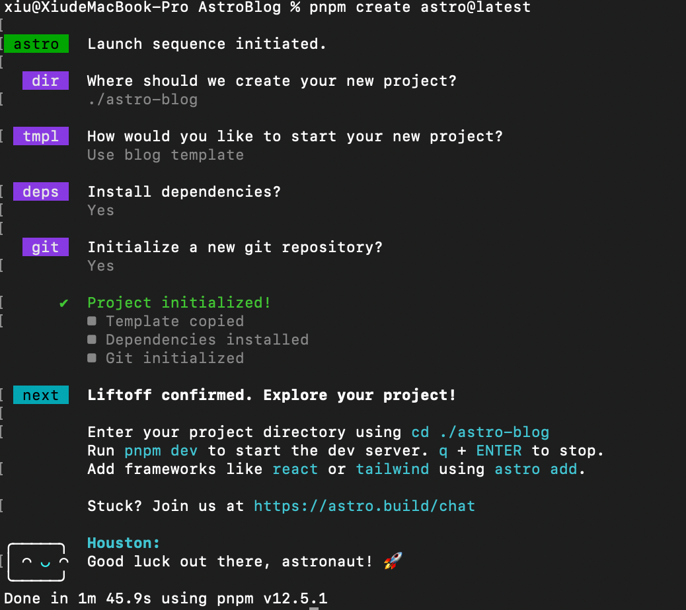

### 2.3 启动Astro开发服务器测试

这样基础的博客模板就生成好了，命令行进入到博客目录下，输入`pnpm run dev`命令启动 `Astro` 开发服务器:  

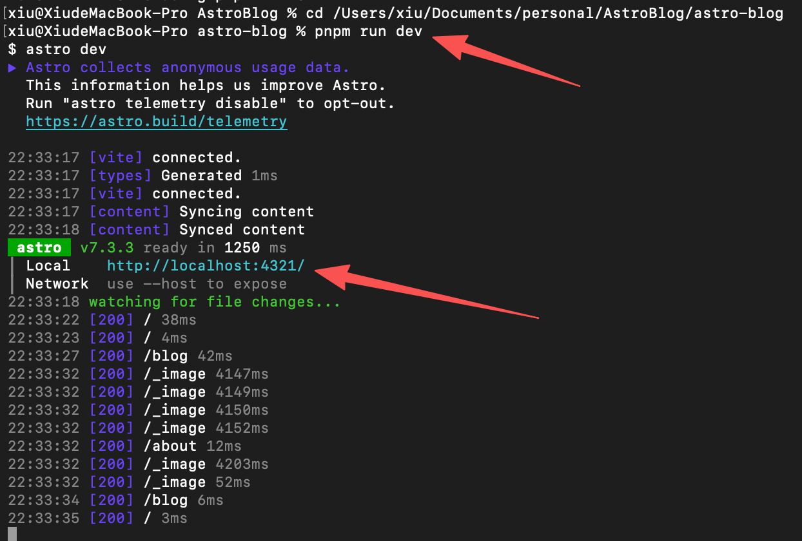

根据运行提示，在浏览器输入 `http://localhost:4321/` 访问博客

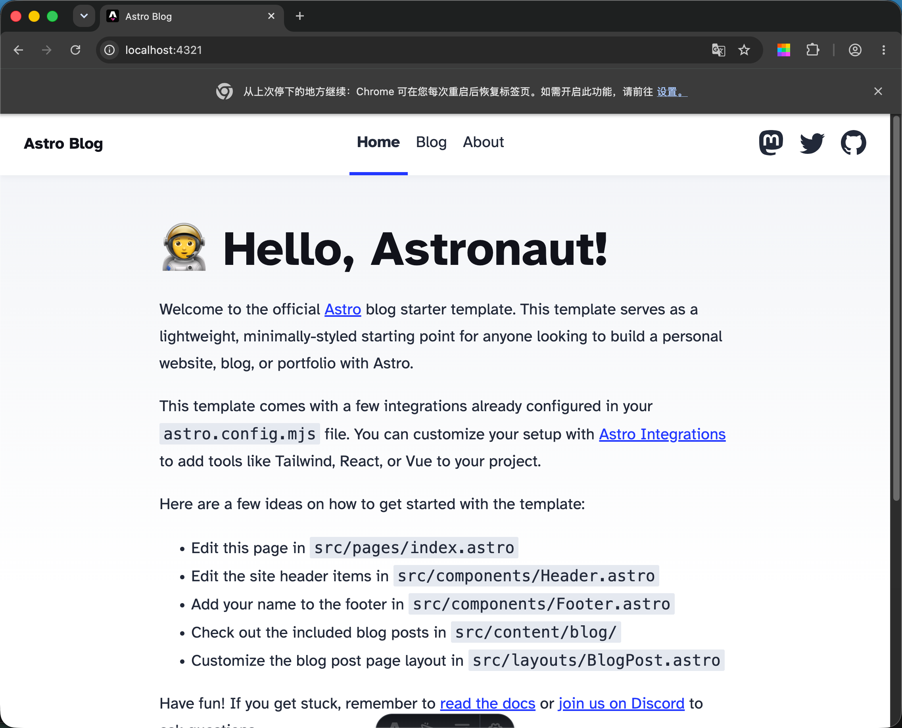

测试完成后，回到命令行`Ctrl+C`关闭服务器。

### 2.4 Astro项目结构

打开前面创建的Astro博客根目录，我们通过这个例子来了解下Astro项目的文件结构。

- src/：放所有需要处理的源码。Astro 通过构建、压缩、处理这里的文件（页面、组件、样式等）创建最终传递到浏览器的网站。

- public/：放完全静态的资源。如某些图片和字体，或特殊文件（如 robots.txt 和 manifest.webmanifest）等等。
  - 所谓完全静态指的是该资源的最终形态在网站构建前就已经确定，Astro在构建网站时，不会去转换、编译、打包或优化这些文件和资源。
  - 这个文件夹中的文件将会被原封不动地复制到构建文件夹中，也就是直接复制到Astro最终生成的网站目录中。

- src/pages/：放页面文件，决定网站页面路径。

- Astro 使用基于文件的路由，它根据项目 src/pages 目录中的文件结构来生成你的构建链接。[Astro路由 | Docs](https://docs.astro.build/zh-cn/guides/routing/)

更多相关内容参考官方文档：[Astro项目结构 | Docs](https://docs.astro.build/zh-cn/basics/project-structure/)

## 3 配置Astro博客主题

这里直接使用的可Fork的主题库，可以新建个空文件夹。

### 3.1 Astro博客主题模板推荐

- `AstroPaper`：非常简约、干净，页面结构简单，适合喜欢极简风格的博主。`Lighthouse Score`全满分，不足之处就是暂时没有侧边目录，长文章阅读起来体验不好。[官方仓库链接](https://github.com/satnaing/astro-paper)
- `Firefly`：基于 `Fuwari` 模板开发，做了创新升级，如双侧边栏、文章网格（多列）、瀑布流布局等，中文友好，文档丰富详细。[官方仓库链接](https://github.com/CuteLeaf/Firefly)
- `Astro Cactus`：和Paper一样也是简约风，Lighthouse Score全满分。[官方仓库链接](https://github.com/chrismwilliams/astro-theme-cactus)
- `Astro Theme Pure`：设计独特，一打开就有让人眼前一亮的感觉，在网站内容组织方面也比较新颖，`Lighthouse Score`全满分。[官方仓库链接](https://github.com/cworld1/astro-theme-pure)
- `Fuwari`：优雅美观，中规中矩，页面结构和大多数博客主题设计相似，文档比较简陋。[官方仓库链接](https://github.com/saicaca/fuwari)

### 3.2 Fork主题仓库Firefly

首先Fork一下你选择的Astro博客主题仓库（这里我用的是Firefly）到自己的Github仓库：仓库名、描述可以自定义，只拷贝主分支。

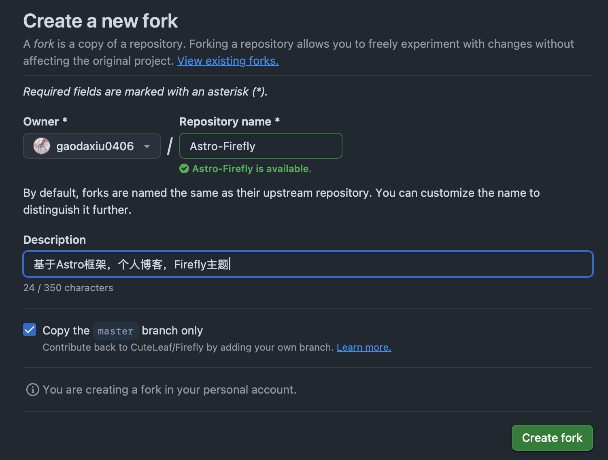

然后再克隆到本地：

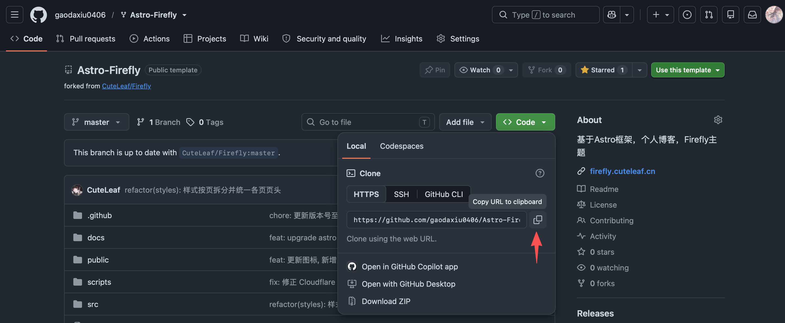

```js
git clone 上图中你复制的地址
```

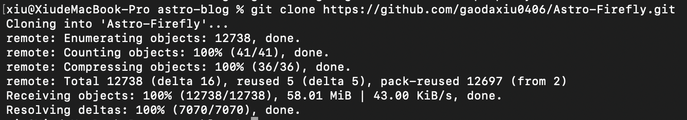

### 3.3 制定分支策略

核心原则：不要直接在 master 分支做自定义修改，让 master 分支纯粹用于跟踪原博客主题仓库的更新，自定义修改放在独立的开发分支中。

```js
// 1. 创建专属的开发分支（比如叫 dev），所有自定义修改都在这个分支做 
git checkout -b dev 

// 2. 把本地的 dev 分支推送到你的 Fork 仓库（后续提交都推到这个分支） 
git push -u origin dev

// 3. 查看本地分支和远程分支的关联状态（关联后，后续可以直接 git push）
git branch -vv
```

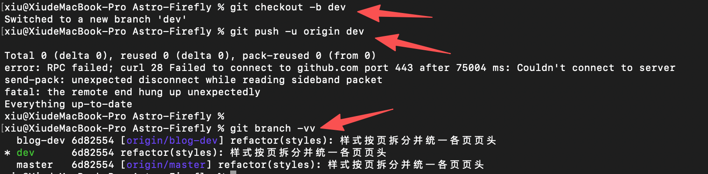

### 3.4 配置与DIY博客

首次拉取主题仓库到本地后，需要先安装依赖

```js
// 安装项目依赖
pnpm install
```

1.在本地启动开发服务器，在浏览器中实时预览博客效果。

运行以下命令启动开发服务器：

```js
pnpm dev
```

博客将在 `http://localhost:4321` 可用。

2.对照所选博客主题的官方文档，修改对应配置文件。

3.根据预览结果，逐项调整、测试配置，直到效果符合预期。

这个过程的技术门槛并不高，需要投入一定耐心。

### 4.1 写文章

不同博客主题，文章存放位置略有不同，具体要查看主题文档，比如`Firefly`主题的文章文件放在 `src/content/posts/` 目录中。

另外文章`Frontmatter`字段的设定也不一样，我们只需要依据主题官方文档来配置即可。

更多内容查阅官方文档： [Astro 中的 Markdown | Docs](https://docs.astro.build/zh-cn/guides/markdown-content/#_top)

### 4.3 构建与预览网站

1. 首先执行构建命令`pnpm build`

`Astro` 会把你的网站打包成可直接上线的版本，放在Astro项目根目录的 `dist/` 文件夹里，打包进度会在终端里显示。

打包过程中会自动检查项目里的各类错误，帮你在正式上线前及时发现问题；如果你的 `TypeScript` 开启了 `strict` 或 `strictest` 严格模式，打包时还会额外检查代码的类型错误。

2. 构建完成后，你可以在终端执行预览命令`pnpm preview`

> 执行后就能在本地浏览器中预览已构建好的网站。需要注意的是，预览展示的是你最后一次执行 `pnpm build` 时的网站状态 —— 如果在打包后修改了代码，这些改动不会立刻出现在预览中，必须重新运行 `pnpm build` 打包，才能看到最新的修改效果。

若要退出预览模式，可按下 `Ctrl + C` 终止预览进程，随后在终端执行其他命令（例如重启开发服务器）即可回到开发模式。开发模式下，你的代码修改会实时同步到预览窗口，无需重复构建。

### 4.2 日常维护博客

平时修改博客内容、调整自定义配置等常规操作，全程在你的开发分支（如 `dev`） 完成，`master` 分支保持 “干净”（仅用于跟踪原仓库更新），避免日常操作污染主分支。

```js
// 1. 确保当前在开发分支（每次操作前先确认，避免切错分支）
git branch // 查看本地所有分支，会显示当前所在本地分支（高亮） 
git branch -a // 查看本地及远程所有分支，会显示当前所在本地分支（高亮） 
git checkout dev // 若当前不在dev分支，执行当前命令会切换到本地dev分支

// 2. 查看修改内容（可选，但建议做，确认只提交需要的修改） 
git status 

// 3. 将修改的文件加入暂存区
git add .

// 4. 提交修改（备注最好要清晰，方便后续追溯） 
git commit -m "修改主页布局" 

// 5. 推送到你的Fork仓库（把本地修改同步到GitHub） 
git push origin dev // 将本地dev同步到GitHub的dev分支 注意：此时远程master主分支与dev分支并未同步，dev分支才是你修改后的最新代码
```

## 5 Vercel 部署

`Astro`部署方案有很多，具体参考官方文档：部署你的 `Astro` 站点 [Docs](https://docs.astro.build/zh-cn/guides/deploy/)

| 平台 | 免费额度 | 国内访问 | 适合场景 |
| --- | --- | --- | --- |
| ‌Cloudflare Pages‌ | 无限带宽/请求 | 部分地区良好 | 首选，性价比最高 |
| ‌GitHub Pages‌ | 1GB存储/100GB带宽/月 | 一般 | 开源项目展示 |
| ‌Vercel‌ | 100GB带宽/月 | 不稳定 | 个人博客/文档 |
| ‌Netlify‌ | 100GB带宽/月 | 一般 | 企业级应用 |

由于之前使用HEXO搭建博客的时候用的‌ `GitHub`，所以这里我就没再尝试使用`‌GitHub Pages`‌部署了。
我尝试使用`Cloudflare Pages`和`‌Netlify‌`部署，都没有成功。最终使用`‌Netlify`‌部署成功。

### 5.1 本地部署 `Netlify`

全局安装 `netlify-cli`

```js
npm install -g netlify-cli
```

验证是否安装成功

```js
netlify --version
```

输出版本号即为安装成功

### 5.2 `Netlify` 关联项目

登录[ Netlify 官网](https://app.netlify.com)，如果没有账号需要注册一下，可以直接关联GitHub登录。这里我是直接关联的GitHub登录。

在官网点击`Add new project`新建一个项目

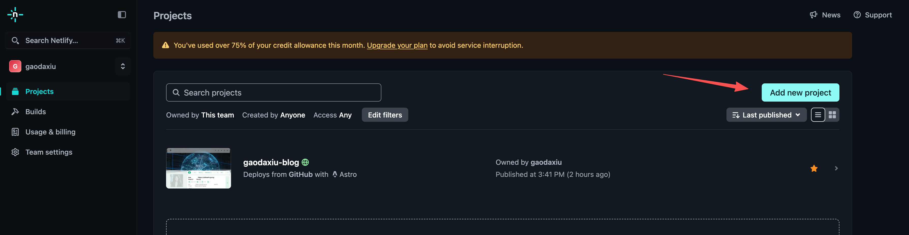

选择引入/关联你的项目，我的项目在github上，所以我这里选择的GitHub

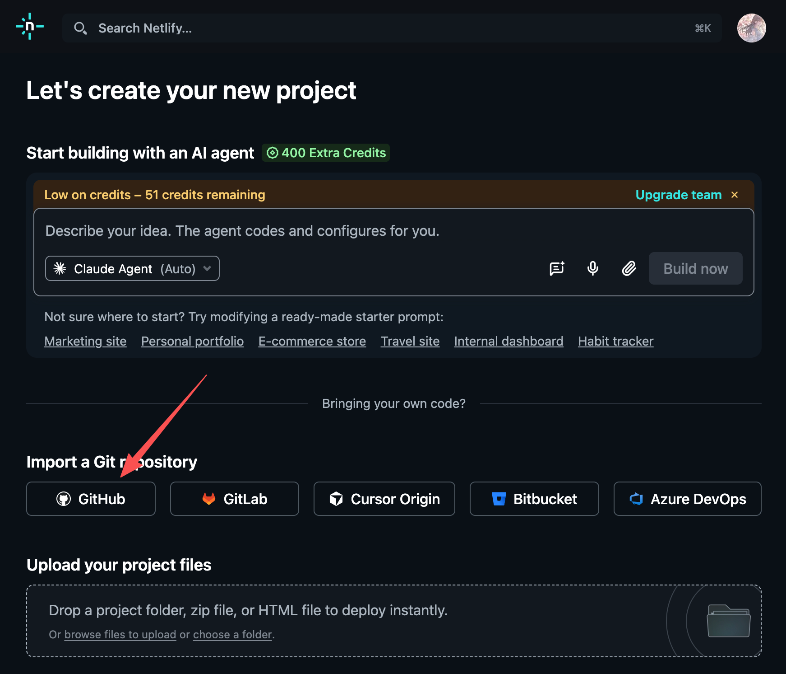

选择/搜索你的项目库并选择

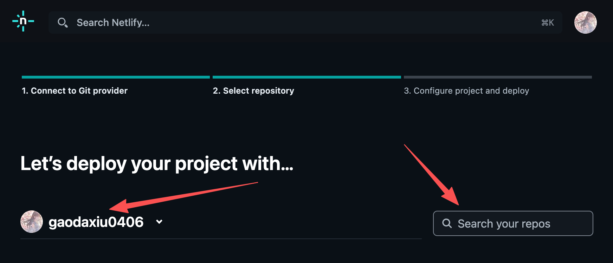

填写你的项目名称（最终会成功访问链接中）

**注意：** 如果你的项目最新代码也在dev分支上，这里一定要将Build settings选择为dev分支。（这里默认打包的是master分支）

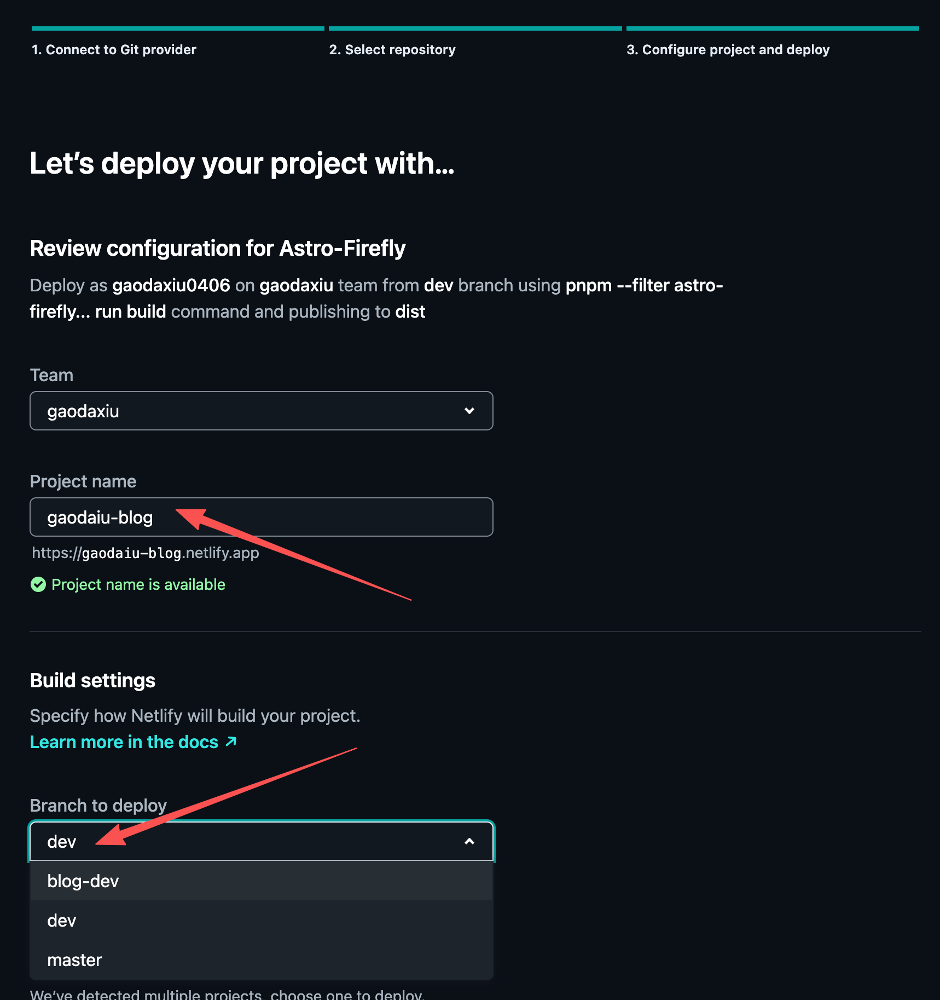

到页面最底部，点击 "Deploy 你的项目名称"按钮

跳转的页面最底下，已经开始自动打包部署了，点击进去可以看到详细

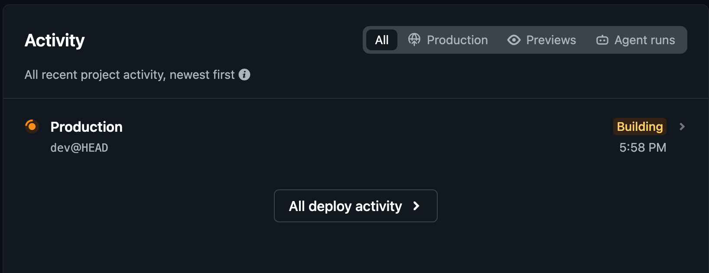

刚发布的项目，项目名称后面有个锁的图标，这代表当前这个项目虽然发布成功了，但它现在是个私有项目，别人可能访问不到你的项目，点击“visitor access settings”去设置

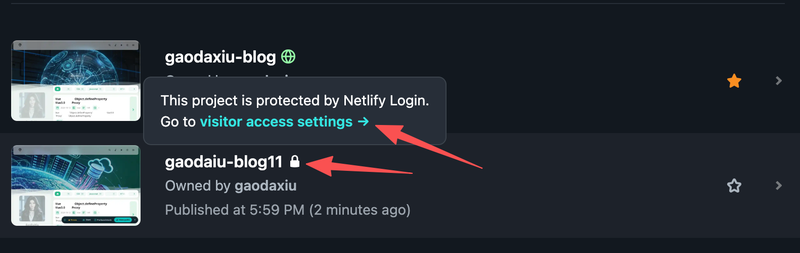

点击Edit visibility 去编辑

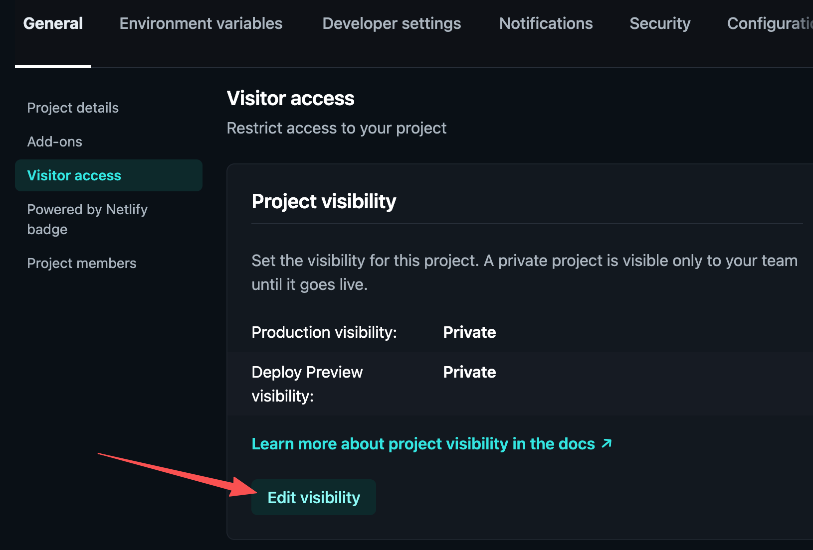

选择Public，点击 Save 保存设置

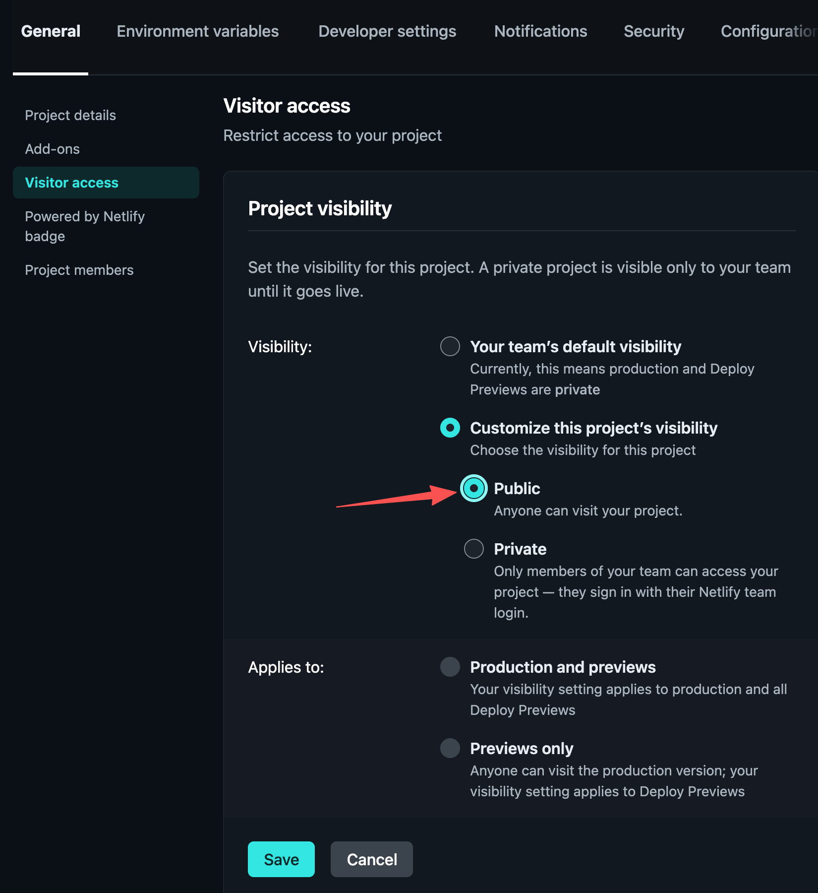

当这里的图标是这样的，说明项目部署成功了。点击进入当前项目，可以看到项目的详细设置

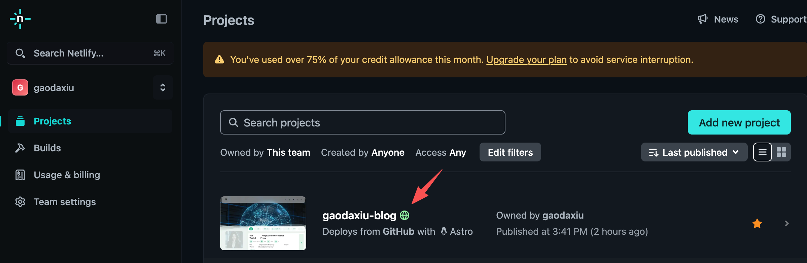

点击 Share ，弹框中复制链接，就可以访问你的博客地址了。

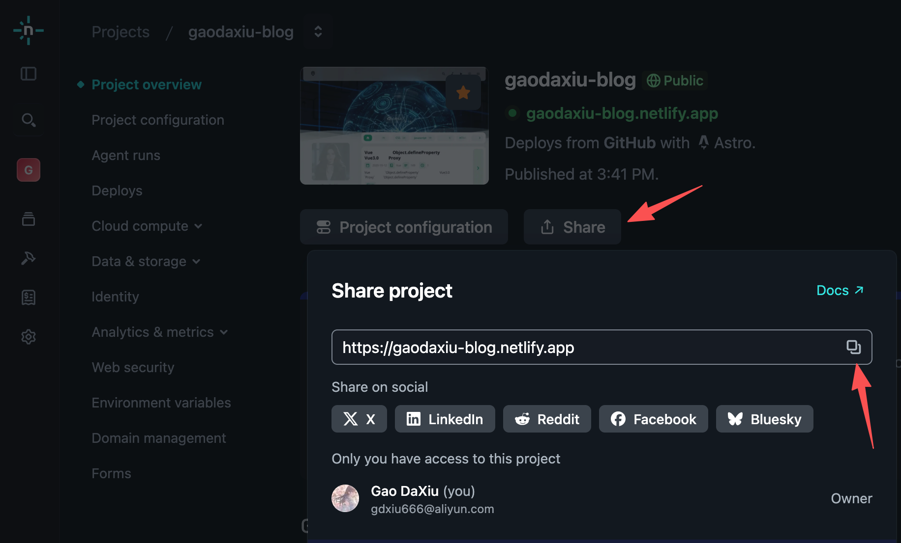
