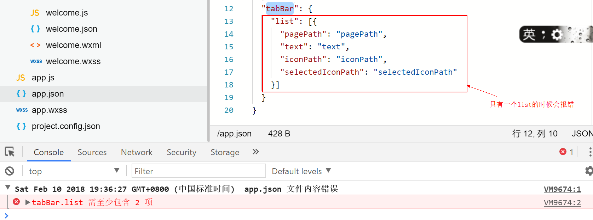

---
# 必填。项目名称。
title: "微信小程序"
# 可选，和文章一样使用。
slug: 微信小程序
# 必填。发布/更新日期，如 2025-10-01。用于排序（配合 order）。
published: 2018-02-10
# 可选，默认 false。设为 true 时生产构建会隐藏该页，预览可见。
draft: false
# 可选。手动排序权重，越大越靠前；未设置则按 published 降序。
order: 1
# 可选。卡片简介 + 详情页描述。
description: "微信小程序"
# 可选。封面图。支持完整 URL、公共根路径（/images/xxx.png）、相对路径（相对本文件目录，如 images/xxx.png）。留空则不显示封面。
image: "./images/tabBarErr.jpg"
# 可选。项目状态，用标准 key:planning计划中 developing开发中 published已发布 archived已归档
status: "archived"
# 分类
category: 微信小程序
tags:
  - 微信小程序
# 可选。外链按钮数组：{ label, icon, value }。icon 可用 astro-icon 名（如 fa7-brands:github）、图片 URL，或留空用 label 首字母。
# link: []
# 可选。页面语言，如 zh_CN。
# lang: zh_CN
# 可选。标签，列表页与详情页显示为 #标签。
---

## app文件
- app.json全局的配置样式
- app.wxss全局的css样式
- app.js全局的js样式
<!-- more -->
### app.json
- 在该文件中不能使用‘//’来注释信息，否则报错

```css
{
  "pages": [
    "pages/welcome/welcome"
  ],
  "window": {
    "navigationBarBackgroundColor": "#b0b0b0",   //导航条的颜色
    "navigationBarTextStyle": "#fff",   //文字的样式
    "navigationBarTitleText": "Welcome",  //标题
    "backgroundColor": "#eeeeee",   //下拉样式的背景色
    "backgroundTextStyle": "light", //light和dark两个值，下拉样式中三个点的颜色，dark代表白色，light代表黑色
    "enablePullDownRefresh": true   //是否可见下拉刷新
  }
}
```

- pages的第一个参数就是默认打开的页面
- 微信开发者工具，一个开发者只能一次打开一个页面，不能同时开多个页面

### welcome.wxml
- view替代div，view相当于一个盒子、一个视图框、一个容器
- text标签替换span/p标签，text标签是我们所谓的文本标签
- image标签，图片标签，src图片路径可以使用绝对路径/相对路径
- 文本不套text标签，在手机端是无法被选中的(无法复制)

```html
<view class='container'>
  <image src='../../images/touxiang.jpg' class='avatar'></image>
  <text class='title'>one</text>
  <text class='content'>hello world</text>
</view>
```

#### 1.事件(`https://mp.weixin.qq.com/debug/wxadoc/dev/framework/view/wxml/event.html`)
- 事件分为冒泡事件和非冒泡事件：
    - 冒泡事件：当一个组件上的事件被触发后，该事件会向父节点传递。
        - bindtap 绑定点击事件  会冒泡
    - 非冒泡事件：当一个组件上的事件被触发后，该事件不会向父节点传递。
        - catchtap 不会冒泡

- WXML的冒泡事件列表：

|类型|触发条件|最低版本|
|----|----|----|
|`touchstart`|手指触摸动作开始||
|`touchmove`|手指触摸后移动||
|`touchcancel`|手指触摸动作被打断，如来电提醒，弹窗||
|`touchend`|手指触摸动作结束||
|`tap`|手指触摸后马上离开||
|`longpress`|手指触摸后，超过350ms再离开，如果指定了事件回调函数并触发了这个事件，tap事件将不被触发|`1.5.0`|
|`longtap`|手指触摸后，超过350ms再离开（推荐使用longpress事件代替）||
|`transitionend`|会在 WXSS transition 或 wx.createAnimation 动画结束后触发||
|`animationstart`|会在一个 WXSS animation 动画开始时触发||
|`animationiteration`|会在一个 WXSS animation 一次迭代结束时触发||
|`animationend`|会在一个 WXSS animation 动画完成时触发||

- **注：除上表之外的其他组件自定义事件如无特殊声明都是非冒泡事件，如`<form/>`的submit事件，`<input/>`的input事件，`<scroll-view/>`的scroll事件，(详见各个组件)**

### welcome.wxss
- 小程序开发文档地址：`https://mp.weixin.qq.com/debug/wxadoc/dev/framework/view/wxss.html`，WXSS样式中有介绍
- 目前支持的选择器有：

|选择器|样例	|样例描述|
|----|----|----|
|.class|`.intro`|选择所有拥有 class="intro" 的组件|
|#id|`#firstname`|选择拥有 id="firstname" 的组件|
|element|`view`|选择所有 view 组件|
|element,element|`view, checkbox`|选择所有文档的 view 组件和所有的 checkbox 组件|
|::after|`view::after`|在 view 组件后边插入内容|
|::before|`view::before`|在 view 组件前边插入内容|

- 支持flex布局
- 不以px为单位，因为要支持适配各种尺寸手机，用rpx为单位
    - 1rpx=2px(在iphone6下)
    - 宽度(iphone6) 750rpx=100%
    - 高度一般采用rpx
    - 线条 1px(仍然是实际的高度);

#### 尺寸单位

- rpx（responsive pixel）: 可以根据屏幕宽度进行自适应。规定屏幕宽为750rpx。如在 iPhone6 上，屏幕宽度为375px，共有750个物理像素，则750rpx = 375px = 750物理像素，1rpx = 0.5px = 1物理像素。

|设备|rpx换算px(屏幕宽度/750)|px换算rpx (750/屏幕宽度)|
|----|----|----|
|iPhone5|1rpx = 0.42px|1px = 2.34rpx|
|iPhone6|1rpx = 0.5px|1px = 2rpx|
|iPhone6 Plus|1rpx = 0.552px|1px = 1.81rpx|

- 建议： 开发微信小程序时设计师可以用 iPhone6 作为视觉稿的标准。

- 注意： 在较小的屏幕上不可避免的会有一些毛刺，请在开发时尽量避免这种情况。

### app.wxss中设置公用样式(如字体)

### 点击跳转页面
#### 1.welcome.js
```js
// pages/welcome/welcome.js
Page({
  /*页面的初始数据*/
  data: {
  },
  bindToHome(){
    //关闭当前页面,跳转到应用内的某个页面，所有的方法都是异步的
    //redirectTo 重定向 跳到下页，下页无返回按钮
    wx.redirectTo({
      url: '../home/home',
      success:function(){

      },
      fail:function(){

      },
      complete:function(){

      }
    });
    //navigateTo保留当前页面，跳转到应用内的某个页面 只适合导航跳转
    wx.navigateTo({
      url: '../home/home',
    })
  }
})
```

#### 2.welcome.wxml
```html
<view class='container'>
  <image src='../../images/touxiang.jpg' class='avatar' bindtap='bindToHome'></image>
  <text class='title'>one</text>
  <text class='content'>hello world</text>
</view>
```

### 更改子级页面的title
- 内部/子级页面没有pages属性，只有window属性
#### 1.home.json
- 子页面不需要写window了
```js
{
    "navigationBarBackgroundColor": "green",
    "navigationBarTextStyle": "yellow",
    "navigationBarTitleText": "主页"
}
```

### 主页的tab键
#### 1.app.json
- tabBar配置文档地址`https://mp.weixin.qq.com/debug/wxadoc/dev/framework/config.html`
- tabBar(tab的列表最少2个，最多5个)
"当tab列表不足2个的时候会报错"

- tabBar列表有两个
```js
"tabBar": {
    "borderStyle": "white",//tab盒子的border-top，有两个值black（黑色）、white（白色）
    "color": "red",//字体颜色
    "selectedColor": "orange",//激活的字体颜色
    "list": [{
      "pagePath": "pages/home/home",//页面路径(跳转的对应路径)，只能使用相对路径
      "text": "首页",
      "iconPath": "images/anhoo.png",//页面默认的icon路径，只能使用相对路径
      "selectedIconPath": "images/anhoo1.png"
    },{
      "pagePath": "pagePath",
      "text": "text",
      "iconPath": "images/anhoo.png",
      "selectedIconPath": "selectedIconPath"
    }]
  }
```

- **此处有坑**
    - 升级到1.2版本后，如果有tabBar，只能使用switchTab方式切换
    ```js
    //保留当前页面，跳转到应用内的某个页面 navigateTo只适合导航跳转
        // wx.navigateTo({
        //   url: '../home/home',
        // });
        //跳转到tabBar页面,并关闭其他所有非tabBary页面
        //如果有tabBar，只能使用switchTab方式切换
        wx.switchTab({
          url: '',
        })
    ```

- 此时app.json文件
```js
{
  "pages": [
    "pages/welcome/welcome",
    "pages/home/home",
    "pages/notes/notes",
    "pages/event/event"
  ],
  "window": {
    "navigationBarBackgroundColor": "#b0b0b0",
    "navigationBarTextStyle": "green",
    "navigationBarTitleText": "Welcome"
  },
  "tabBar": {
    "borderStyle": "white",
    "color": "red",
    "selectedColor": "orange",
    "list": [{
      "pagePath": "pages/home/home",
      "text": "首页",
      "iconPath": "images/anhoo1.png",
      "selectedIconPath": "images/anhoo.png"
    },{
      "pagePath": "pages/notes/notes",
      "text": "笔记",
      "iconPath": "images/anhoo1.png",
      "selectedIconPath": "images/anhoo.png"
    }]
  }
}
```

### 主页banner制作
- 为了开发方便，将app.json中的pages配置调换一下位置，将home文件的配置放在最上面
```
 "pages": [
    "pages/home/home",
    "pages/notes/notes",
    "pages/event/event",
    "pages/welcome/welcome"
  ]
```
- 此时默认打开的就是首页

#### 1.home.wxml

- 不能使用jQuery等，因为微信小程序中没有dom
- swiper内置的组件，滑动插件
    - `autoplay='{{true}}'`自动播放，默认`{{false}}`;
    - **此处有坑:不能写成`autoplay='true'`或者`autoplay='false'`，这样写是字符串，默认转为布尔类型，即使设置为`false`，`'false'`转为布尔类型也是`true`，也会自动播放，所以一定要加`双大括号`**
    - interval自动切换间隔时间
    - `indicator-dots='{{true}}'`轮播图对应的小点
    - **同autoplay，一定要加`双大括号`**
    - `circular='{{true}}'`循环轮播
    - **同autoplay，一定要加`双大括号`**
    - `vertical='{{true}}'` 轮播图上下滚动
    - **此处有坑:设置banner图的高，不能给swiper-item标签设置，要给他的父级swiper标签设置**
    ```html
    //设置banner图的高为600rpx,此处的style不需要加`双大括号`
    <swiper autoplay='{{true}}' interval='1000' indicator-dots='{{true}}' circular='{{true}}' vertical='{{true}}' style='height:600rpx;'>
      <swiper-item>
        <image src='/images/banner1.jpg'></image>
      </swiper-item>
      <swiper-item>
        <image src='/images/banner2.jpg'></image>
      </swiper-item>
      <swiper-item>
        <image src='/images/banner3.jpg'></image>
      </swiper-item>
      <swiper-item>
        <image src='/images/banner4.jpg'></image>
      </swiper-item>
      <swiper-item>
        <image src='/images/banner5.jpg'></image>
      </swiper-item>
    </swiper>

    ```

### 绑定动态数据
- 数据是单向绑定，数据改动了可以渲染视图，但是视图改动了不会刷新数据
- wx:key 静态遍历不需要
- 1.home.js

```css
data:{
    imgs:[
      '/images/banner1.jpg',
      '/images/banner2.jpg',
      '/images/banner3.jpg',
      '/images/banner4.jpg',
      '/images/banner5.jpg'
    ]
}
```

- `{{item}} wx:for='{{imgs}}'`

- 2.home.wxml

```html
<swiper autoplay='{{true}}' interval='1000' indicator-dots='{{true}}' circular='{{true}}'>
  <swiper-item wx:for='{{imgs}}'>
    <image src='{{item}}'></image>
  </swiper-item>
</swiper>
```

- `wx:for-item='num'`可指定item叫什么名字，这里的item就叫num

- 2.home.wxml

```html
<swiper autoplay='{{true}}' interval='1000' indicator-dots='{{true}}' circular='{{true}}'>
  <swiper-item wx:for='{{imgs}}' wx:for-item='num'>
    <image src='{{num}}'></image>
  </swiper-item>
</swiper>
```

- **注意:`wx:for-item='num'`,num不加`双大括号`**


