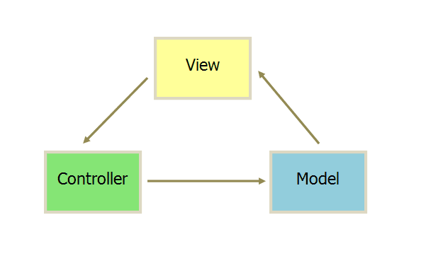
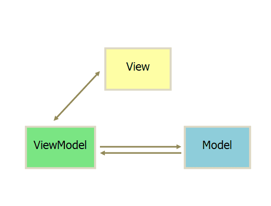

---
# 必填。项目名称。
title: "秒懂Vuejs、Angular、React原理和前端发展历史(转载)"
# 可选，和文章一样使用。
slug: 秒懂Vuejs、Angular、React原理和前端发展历史(转载)
# 必填。发布/更新日期，如 2025-10-01。用于排序（配合 order）。
published: 2017-09-10
# 可选，默认 false。设为 true 时生产构建会隐藏该页，预览可见。
draft: false
# 可选。手动排序权重，越大越靠前；未设置则按 published 降序。
order: 1
# 可选。卡片简介 + 详情页描述。
description: "秒懂Vuejs、Angular、React原理和前端发展历史(转载)"
# 可选。封面图。支持完整 URL、公共根路径（/images/xxx.png）、相对路径（相对本文件目录，如 images/xxx.png）。留空则不显示封面。
image: "./images/MVVM.png"
# 可选。项目状态，用标准 key:planning计划中 developing开发中 published已发布 archived已归档
status: "archived"
# 分类
category: 前端框架
tags:
  - 前端框架
  - Vue
  - Angular
  - React
# 可选。外链按钮数组：{ label, icon, value }。icon 可用 astro-icon 名（如 fa7-brands:github）、图片 URL，或留空用 label 首字母。
# link: []
# 可选。页面语言，如 zh_CN。
# lang: zh_CN
# 可选。标签，列表页与详情页显示为 #标签。
---
## 前端程序发展的历史
- 现在流行的框架：Vue.Js、AngularJs、ReactJs，已经逐渐应用到各个项目和实际应用中，它们都是MVVM数据驱动框架系列的一种。
<!-- more -->
- 回顾一下前端发展的历史阶段,引用了 廖雪峰老师网站总结的一段话:
```html
在上个世纪的1989年，欧洲核子研究中心的物理学家Tim Berners-Lee发明了超文本标记语言（HyperText Markup Language），简称HTML，并在1993年成为互联网草案。从此，互联网开始迅速商业化，诞生了一大批商业网站。
最早的HTML页面是完全静态的网页，它们是预先编写好的存放在Web服务器上的html文件。
浏览器请求某个URL时，Web服务器把对应的html文件扔给浏览器，就可以显示html文件的内容了。
如果要针对不同的用户显示不同的页面，显然不可能给成千上万的用户准备好成千上万的不同的html文件，所以，服务器就需要针对不同的用户，动态生成不同的html文件。一个最直接的想法就是利用C、C++这些编程语言，直接向浏览器输出拼接后的字符串。这种技术被称为CGI：Common Gateway Interface。
很显然，像新浪首页这样的复杂的HTML是不可能通过拼字符串得到的。于是，人们又发现，其实拼字符串的时候，大多数字符串都是HTML片段，是不变的，变化的只有少数和用户相关的数据，所以，又出现了新的创建动态HTML的方式：ASP、JSP和PHP等——分别由微软、SUN和开源社区开发。
在以前：
在ASP中，一个asp文件就是一个HTML，但是，需要替换的变量用特殊的<%=var%>标记出来了，再配合循环、条件判断，创建动态HTML就比CGI要容易得多。
但是，一旦浏览器显示了一个HTML页面，要更新页面内容，唯一的方法就是重新向服务器获取一份新的HTML内容。如果浏览器想要自己修改HTML页面的内容，怎么办？那就需要等到1995年年底，Java被引入到浏览器。
有了Java后，浏览器就可以运行Java，然后，对页面进行一些修改。Java还可以通过修改HTML的DOM结构和CSS来实现一些动画效果，而这些功能没法通过服务器完成，必须在浏览器实现。
```

## 揭开MVVM原理
- Java操作HTML
- 至于 js如何在浏览器执行，这又是另外一个资深课题了（前端真的是只是庞杂），这里我们不做研究，有兴趣的可以自己去搜资料。我们只需要知道浏览器就是也JS执行容器，执行完之后，通过页面显示结果就行了，就像java需要编译器一样原理。
- 用Java在浏览器中操作HTML，也经历了若干发展阶段： 我们利用【小北最帅】这个案例来展示

## 【第一阶段】
- 是JS原生通过浏览器解析机制，它的原理是使用浏览器提供的原生API 结合JS语法，可以直接操作DOM，如：
```html
  //HTML:
  <divid="name"style="color:#fff">前端你别闹</div><divid="age">3</div>
  //Java:
  var dom1 = document.getElementById('name');
  var dom2 = document.getElementById('age');
  dom1.innerHTML = '小北';
  dom2.innerHTML = '666';
  dom1.style.color = '#000000'; // css样式也可以操作
  //结果变成：
  <divid="name"style="color:#fff">小北</div><divid="age">'666</div>
```

## 【第二阶段】
- 我用一个字总结 就是懒，就是我们上一篇说的jQuery时代，由于原生API晦涩难懂，语法很长不好用，最重要的是要考虑各种浏览器兼容性，因为他们的解析标准都不一样，造成了，写一段效果代码要写很多的兼容语法，令人沮丧，所以jQuery的出现，迅速占领了世界。
- 上边的例子用 jQuery 是这样的
```html
//HTML:
<divid="name"style="color:#fff">前端你别闹</div><divid="age">3</div>
//Java: jQuery 一句话就行
$('#name').text('小北好帅').css('color', '#000000');$('#age').text('666').css('color', '#fff');
//结果变成：
<divid="name"style="color:#fff">小北好帅</div><divid="age">666</div>
```

## 【第三阶段】
### MVC模式，
- 需要服务器端配合，Java可以在前端修改服务器渲染后的数据。
- 一句话就是所有通信都是单向的： 也就是前期我们最常用的状态，提交一次反馈一次，通信一次相互制约。
- 比如：提交表单 填写内容 → 点击提交 →业务逻辑处理 →存入数据库 → 刷新页面→服务器取数据库数据→渲染到客户端页面→ 展示上一次你提交的内容
- MVC:
    - 视图（View）：用户界面。
    - 控制器（Controller）：业务逻辑
    - 模型（Model）：数据保存
    - 各部分之间的通信方式如下
    "MVC"
    - View 传送指令到 Controller
    - Controller 完成业务逻辑后，要求 Model 改变状态
    - Model 将新的数据发送到 View，用户得到反馈
- 这个模式缺点是什么呢？
    - 缺点一：它必须等待服务器端的指示，而且如果是异步模式的话，所有html节点、数据、页面结构都是后端请求过来。
            - 浏览器只作为一个解析显示容器，Model 作用几乎是废x，Model 层面做的很少几乎前端无法控制，你前端几乎是切图仔和做轮播图的工作/哭
    - 缺点二：因为你前端渲染的页面结构，几乎是后端服务器包扎一堆数据一起发送过来，前端的你只需要用拼接字符串 或者字符串拼接引擎
        - 比如Mustache、Jade、artTemplate、tmpl、kissyTemplate、ejs等来做事，说白了纯苦力和重复工作居多，这也导致了，如果很多人认为前端并不重要，只负责美工 和 动作体验就好了。
    - 缺点三：一发而动全身。数据、显示不分离！为什么这么说，因为如果业务逻辑要变，比如很简单的需求，你用jsp或者php 拼接出来的ajax数据页面，年龄这个字段我不需要了，把性别字段 区分开，男的单独显示，女的单独显示，以前是一起显示到一个表的
        - 那么，后端先要sql查询把 男、女数据分开，然后渲染字符串时候把 年龄 这个字段去除，然后把男女分开成2个table，然后再推送给前端接收。
        - 前端收到了，然后从新在渲染一遍，在加工一次页面甚至是展示动作效果。。。（前后端一起大声喊到：加班使我快乐，呜呜呜）

## 【第四阶段】
### MVVM框架模式
- MVVM最早由微软提出来，它借鉴了桌面应用程序的MVC思想，在前端页面中，把Model用纯Java对象表示，View负责显示，两者做到了最大限度的分离。也就是我们常说的，前后分离，真正在这里得以实现
"MVVM"
- 它采用双向绑定（data-binding）：View的变动，自动反映在 ViewModel，反之亦然,model数据的变动，也自动展示给页面显示
- 把Model和View关联起来的就是ViewModel。ViewModel负责把Model的数据同步到View显示出来，还负责把View的修改同步回Model。
- 可能理论知识枯燥无味，那么我们还是实战派，来看代码不就好了吗？
    - 还是刚才的 【小北最帅】案例
    - 由于数据驱动模式的精髓在于【数据】和【视图】分离，所以我们首先并不关心DOM结构，而是关心数据的展现。
    - 最简单的数据存储方式是什么呢？显然不是mysql、数据库而是使用Java对象
    ```js
    //HTML: 这次我不关心你了，哼哼
    //Java: JS基础对象/原始数据
    varxiaobei = { name: '前端你别闹', age: 3，
    tag：'干货'
    };
    //结果是：
    name:前端你别闹
    age:3
    tag:干货
    ```
    - 假设：我们把变量xiaobei 看作Model数据，把HTML某些DOM节点看作View，并意淫它们已经通过某种手段被关联起来了。
    - 下面我们把name 从"前端你别闹" 改为 "小北"，把显示的age从 "3" 改为 "666"，tag变成 "最帅!"
    - 按照以前我们肯定操作DOM节点，而现在我们只需要修改Java对象：
    ```js
    Java:// JS基础对象// 改变的数据
        varxiaobei = { name: '小北', age: 666，
        tag：'最帅'
        };
    //结果是：
        name:小北
        age:666
        tag:最帅
    ```
- 通过实验和理论，小伙伴惊呆了，我们只要改变Java对象的内容，就会导致DOM结构作出对应的变化！
- 这让我们的关注点从如何操作DOM变成了如何改变Java对象的状态，而操作Java对象比获取和操作DOM简单了一个地球的距离！
- 这也是MVVM的核心思想：关注Model的变化，让MVVM框架利用自己的机制去自动更新DOM，从而把开发者从操作DOM的繁琐中解脱出来！
- 也就是所谓的 数据 - 视图分离，数据驱动视图， 视图不影响数据，再也不用管繁琐的DOM结构操作了，世界顿时清净，完美！

##### 原文链接:`http://www.sohu.com/a/133415335_355137?qq-pf-to=pcqq.c2c`